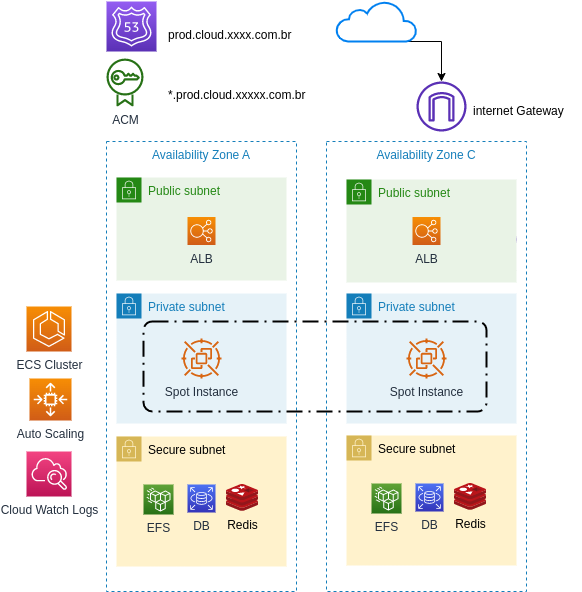

# APP ECS

### The module

This  module builds an Elastic Container Service(ECS) Cluster in AWS:



The following resources will be created:

+ Auto Scale Group:
    + **ecs-(ecsNam)-(account)-(region)**
+ Schedule:
    + **ecs-(ecsName)-start**
    + **ecs-(config.ecsName)-stop**
+ Capacity Provider:
    + **(ecsNam)-(account)-(region)-provider**
+ Launch Template:
    + **ecs-(ecsName)**
+ IAM Instance Profile:
    + **ecs-(ecsNam)-(account)-(region)**
+ ECS:
    + **ecs-(ecsNam)-(account)-(region)**
+ IAM Roles:
    + **ecs-task-(ecsName)-(account)-(region)**
    + **ecs-service-(ecsName)-(account)-(region)**
    + **ecs-role-(ecsName)-(account)-(region)**
    + **codedeploy-service-(ecsName)-(account)-(region)**
+ Security Group:
    + **ecs-(ecsName)-efs**  
    + **int-(ecsName)-(account)-(region)-alb**  
    + **ext-(ecsName)-(account)-(region)-alb**  
    + **ecs-(ecsName)-nodes**
+ ELB:
    + **ecs-(ecsName)-(account)-(region)-internal**
    + **ecs-(ecsName)-(account)-(region)**
    + **Listeners**
    + **Listener Rules**
    + **Targer Groups**
+ EFS:
    + **ecs-(ecsNam)-(account)-(region)**
+ Route 53 Record
+ Code Deploy Application
+ Code Deploy Deployment Group
+ CloudWatch:
    + **LogGroup**
+ App Auto Scale
    + **Target**
    + **Policy**
+ KMS
+ SSM
+ Secrets Manager
+ SNS
+ SQS
+ EC2 Instance
+ Load Balancer
+ Cluster Redis
+ S3
+ Amazon DocumentDB
+ RDS
+ Custom Roles
### Applied to stacks
 - nonprod
 - prod

## [Inputs](Pulumi.nonprod.yaml)

| Name | Description | Type | Default | Required |
|------|-------------|------|---------|:--------:|
| region | aws region | `string` | n/a | yes |
| account |Account name | `string` | n/a | yes |
| ecsName |ECS cluster name | `string` | n/a | yes |
| vpnCidr | VPN Cidr | `string` | n/a | no |
| certificate | Certificate | `string` | n/a | yes |
| throughputMode | Throughput Mode for EFS | `string` | n/a | yes |
| provisionedThroughputInMibps | Provisioned Throughput In Mibps for EFS | `number` | n/a | yes |
| albExternal | Create Application Load Balance Exeternal | `bool` | n/a | yes |
| albInternal | Create Application Load Balance Internal  | `bool` | n/a | no |
| minSize | ECS min nodes number | `number` | n/a | yes |
| maxSize | ECS max nodes number | `number` | n/a | yes |
| onDemandBaseCapacity |You can designate a base portion of your total capacity as On-Demand. As the group scales, per your settings, the base portion is provisioned first, while additional On-Demand capacity is percentage-based.	 | `number` | n/a | yes |
| onDemandPercentageAboveBaseCapacity | Percentage of on-demand intances vs spot.	 | `number` | n/a | yes |
| asgTargetCapacity | Target average capacity percentage for the ECS capacity provider to track for autoscaling.	 | `number` | n/a | yes |
| volumeSize | Volume size for root volume  | `number` | n/a | yes |
| scheduler | Schedler for up or down cluster | `object` | n/a | yes |
| scheduler.enabled | Enable Scheduler | `boll` | n/a | yes |
| scheduler.scheduleCronStart | Cron expression to define when to trigger a start of the auto-scaling group. E.g. '0 20 * * *' to start at 8pm GMT time.	 | `string` | n/a | yes |
| scheduler.scheduleCronStop | Cron expression to define when to trigger a stop of the auto-scaling group. E.g. '0 10 * * *' to stop at 10am GMT time.	 | `string` | n/a | yes |
| scheduler.asgMin | Auto Scale Group min size | `number` | n/a | yes |
| scheduler.asgMax | Auto Scale Group max size | `number` | n/a | yes |
| hostZone | Hosted Zone Domain | `string` | n/a | yes |
| retentionInDays | Log retention in CloudWatch Log Group for apps | `number` | n/a | yes |
| exportToS3 | . | `bool` | n/a | yes |
| launchTypeALB | Launch Type EC2 or FARGATE | `string` | n/a | yes |

## [Input App with ALB](inputs/nonprod/ecs-apps.yaml)
| Name | Description | Type | Default | Required |
|------|-------------|------|---------|:--------:|
| appsWithALB | Applications with load balance to expose service | `object` | n/a | no |
| appsWithALB.name | Application name | `string` | n/a | yes |
| appsWithALB.alb | Load Balance external or internal | `string` | n/a | yes |
| appsWithALB.desiredCount | Desired number container replicas | `number` | n/a | yes |
| appsWithALB.autoscalingMin | Min number container replicas | `number` | n/a | yes |
| appsWithALB.autoscalingMax | Max number container replicas | `number` | n/a | yes |
| appsWithALB.port | Container port | `number` | n/a | yes |
| appsWithALB.image | Container image | `string` | n/a | yes |
| appsWithALB.cpu | CPU units | `number` | n/a | yes |
| appsWithALB.memory | Memory in megabytes | `number` | n/a | yes |
| appsWithALB.paths | Paths to app response | `list(string)` | n/a | yes |
| appsWithALB.hostname | Application hostname for Route 53 | `list(string)` | n/a | yes |
| appsWithALB.protocol | Application Protocol | `string` | n/a | yes |
| appsWithALB.healthcheckPath | Healthcheck Path  | `string` | n/a | yes |
| appsWithALB.healthcheckMatcher | Healthcheck Matcher  | `string` | n/a | yes |
| appsWithALB.scaleUp |  Container scale up  | `object` | n/a | no |
| appsWithALB.enable | Enable container scale up  | `bool` | n/a | no |
| appsWithALB.cpu | Scale by cpu  | `object` | n/a | no |
| appsWithALB.cpu.enabled | Enable scale by cpu  | `bool` | n/a | no |
| appsWithALB.cpu.value | CPU value for scale up  | `number` | n/a | no |
| appsWithALB.memory | Scale by memory  | `object` | n/a | no |
| appsWithALB.memory.enabled | Enable scale by memory  | `bool` | n/a | no |
| appsWithALB.memory.value | Memory value for scale up  | `number` | n/a | no |

## [Input App withouth ALB](inputs/nonprod/ecs-apps.yaml)
| Name | Description | Type | Default | Required |
|------|-------------|------|---------|:--------:|
| appsWithouthALB | Applications without load balance to expose service | `object` | n/a | no |
| appsWithouthALB.name | Application name | `string` | n/a | yes |
| appsWithouthALB.desiredCount | Desired number container replicas | `number` | n/a | yes |
| appsWithouthALB.autoscalingMin | Min number container replicas | `number` | n/a | yes |
| appsWithouthALB.autoscalingMax | Max number container replicas | `number` | n/a | yes |
| appsWithouthALB.image | Container image | `string` | n/a | yes |
| appsWithouthALB.cpu | CPU units | `number` | n/a | yes |
| appsWithouthALB.memory | Memory in megabytes | `number` | n/a | yes |
| appsWithouthALB.scaleUp |  Container scale up  | `object` | n/a | no |
| appsWithouthALB.enable | Enable container scale up  | `bool` | n/a | no |
| appsWithouthALB.cpu | Scale by cpu  | `object` | n/a | no |
| appsWithouthALB.cpu.enabled | Enable scale by cpu  | `bool` | n/a | no |
| appsWithouthALB.cpu.value | CPU value for scale up  | `number` | n/a | no |
| appsWithouthALB.memory | Scale by memory  | `object` | n/a | no |
| appsWithouthALB.memory.enabled | Enable scale by memory  | `bool` | n/a | no |
| appsWithouthALB.memory.value | Memory value for scale up  | `number` | n/a | no |

## [Input SSM](inputs/nonprod/ssm.yaml)
| Description | Type | Default | Required |
|-------------|------|---------|:--------:|
| SSM list  | `list(string)` | n/a | no |

## [Input Secrets Manager](inputs/nonprod/secret-manager.yaml)
| Description | Type | Default | Required |
|-------------|------|---------|:--------:|
| Secret Manager list  | `list(string)` | n/a | no |

## [Input SNS](inputs/nonprod/sns.yaml)
| Name | Description | Type | Default | Required |
|------|-------------|------|---------|:--------:|
| name | SNS name | `string` | n/a | yes |
| subscriptions | Subscriptions list | `list(object)` | n/a | no |
| subscriptions.name | Name | `string` | n/a | yes
| subscriptions.endpoint | Endpoint to send data to | `string` | n/a | yes
| subscriptions.protocol | Protocol to use. Valid values are: sqs, sms, lambda, firehose, and application. Protocols email, email-json, http and https are also valid but partially supported | `string` | n/a | yes |

## [Input SQS](inputs/nonprod/sqs.yaml)
| Name | Description | Type | Default | Required |
|------|-------------|------|---------|:--------:|
| customKMSPermission | [Custom KMS Permission](https://www.pulumi.com/registry/packages/aws/api-docs/iam/getpolicydocument/#getpolicydocumentstatement) | `list(object)` | n/a | no |
| listSqs | SQS list | `list(object)` | n/a | no |
| listSqs.name | Name | `string` | n/a | yes |
| listSqs.policy | [Policy](https://www.pulumi.com/registry/packages/aws/api-docs/iam/getpolicydocument/#getpolicydocumentstatement) | `list(object)` | n/a | no |
| listSqs.tags | Tags to append in SQS | `object` | n/a | yes |

## [Input EC2 Instance](inputs/nonprod/ec2.yaml)
| Name | Description | Type | Default | Required |
|------|-------------|------|---------|:--------:|
| name | Name | `string` | n/a | yes |
| ami | AMI to use for the instance | `string` | n/a | no |
| subnetType | Subnet type to use. Valid values are: private and public | `string` | n/a | yes |
| vpnAccess | VPN accesses the instance | `boolean` | `false` | yes |
| appsAccess | EKS accesses the instance| `boolean` | `false` | yes |
| ingressRules | Ingress Rule | `list(object)` | n/a | no |
| ingressRules.fromPort | Start port | `number` | n/a | yes |
| ingressRules.toPort | End port | `number` | n/a | yes |
| ingressRules.protocol | Protocol. If not icmp, icmpv6, tcp, udp, or all use the [protocol number](https://www.iana.org/assignments/protocol-numbers/protocol-numbers.xhtml) | `string` | n/a | yes |
| ingressRules.sourceSecurityGroupId | Security group to apply this rule to | `string` | n/a | no |
| ingressRules.cidrBlocks | List of CIDR blocks | `list(string)` | n/a | no |
| internetAccess | internet Access | `boolean` | `false` | yes |
| instanceType | Instance type to use for the instance | `string` | n/a | yes |
| managedPolicies | Managed Policies | `list(string)` | n/a | no |
| customPermissions | [Custom Permission](https://www.pulumi.com/registry/packages/aws/api-docs/iam/getpolicydocument/#getpolicydocumentstatement) | `list(object)` | n/a | no |
| userData | User data to provide when launching the instance | `string` | n/a | no |
| volumeSize | Size of the volume in gibibytes (GiB). | `number` | n/a | yes |
| volumeType | Type of volume. Valid values include standard, gp2, gp3, io1, io2, sc1, or st1 | `string` | n/a | yes |

## [Input Load Balancer](inputs/nonprod/lb.yaml)
| Name | Description | Type | Default | Required |
|------|-------------|------|---------|:--------:|
| name | Name | `string` | n/a | yes |
| loadBalancerType | LoadBalancer Type to use. Valid values are: network and application | `string` | n/a | yes |
| sgIngressEgress | Ingress/Egress Rule | `list(object)` | n/a | no |
| sgIngressEgress.type | Type of rule being created. Valid options are ingress (inbound) or egress (outbound) | `string` | n/a | yes |
| sgIngressEgress.fromPort | Start port | `number` | n/a | yes |
| sgIngressEgress.toPort | End port | `number` | n/a | yes |
| sgIngressEgress.protocol | Protocol. If not icmp, icmpv6, tcp, udp, or all use the [protocol number](https://www.iana.org/assignments/protocol-numbers/protocol-numbers.xhtml) | `string` | n/a | yes |
| sgIngressEgress.sourceSecurityGroupId | Security group to apply this rule to | `string` | n/a | no |
| sgIngressEgress.cidrBlocks | List of CIDR blocks | `list(string)` | n/a | no |
| internal | If true, the LB will be internal | `boolean` | `false` | yes |
| subnetType | Subnet type to use. Valid values are: private and public | `string` | n/a | yes |
| enableDeletionProtection | If true, deletion of the load balancer will be disabled via the AWS API. This will prevent this provider from deleting the load balancer | `boolean` | `false` | yes |
| targets | Targets | `list(object)` | n/a | no |
| targets.name | Name | `string` | n/a | yes |
| targets.port | Port on which the load balancer | `number` | n/a | yes |
| targets.protocol | Protocol for connections from clients to the load balancer. For Application Load Balancers, valid values are HTTP and HTTPS, with a default of HTTP. For Network Load Balancers, valid values are TCP, TLS, UDP, and TCP_UDP | `string` | n/a | yes |
| targets.certificateArn | ARN of the default SSL server certificate. Exactly one certificate is required if the protocol is HTTPS | `number` | n/a | no |
| targets.redirect | Configuration block for creating a redirect action | `object` | n/a | no |
| targets.redirect.port | Port | `string` | n/a | yes |
| targets.redirect.protocol | Protocol. Valid values are HTTP, HTTPS, or #{protocol} | `string` | n/a | yes |
| targets.redirect.statusCode | HTTP redirect code. The redirect is either permanent (HTTP_301) or temporary (HTTP_302) | `string` | n/a | yes |
| targets.forward | Configuration block for creating an action that distributes requests among one or more target groups | `list(object)` | n/a | no |
| targets.forward.targetType | [Type of target that you must specify when registering targets with this target group](https://docs.aws.amazon.com/elasticloadbalancing/latest/APIReference/API_CreateTargetGroup.html) | `string` | n/a | no |
| targets.forward.targetId | The ID of the target. This is the Instance ID for an instance, or the container ID for an ECS container. If the target type is ip, specify an IP address. If the target type is lambda, specify the Lambda function ARN. If the target type is alb, specify the ALB ARN. | `string` | n/a | no |
| targets.forward.targetPort | Port on which targets receive traffic, unless overridden when registering a specific target. Required when targetType is instance, ip or alb. Does not apply when targetType is lambda | `number` | n/a | yes |
| targets.forward.targetProtocol | Protocol to use for routing traffic to the targets. Should be one of GENEVE, HTTP, HTTPS, TCP, TCP_UDP, TLS, or UDP. Required when targetType is instance, ip or alb. Does not apply when targetType is lambda | `string` | n/a | yes |
| targets.forward.listenerRules | Configuration block for creating a listerner rules | `list(object)` | n/a | no |
| targets.forward.listenerRules.name | Name | `string` | n/a | yes |
| targets.forward.listenerRules.targetId | The ID of the target. This is the Instance ID for an instance, or the container ID for an ECS container. If the target type is ip, specify an IP address. If the target type is lambda, specify the Lambda function ARN. If the target type is alb, specify the ALB ARN. | `string` | n/a | yes |
| targets.forward.listenerRules.targetPort | Port on which targets receive traffic, unless overridden when registering a specific target. Required when targetType is instance, ip or alb. Does not apply when targetType is lambda | `number` | n/a | yes |
| targets.forward.listenerRules.targetType | [Type of target that you must specify when registering targets with this target group](https://docs.aws.amazon.com/elasticloadbalancing/latest/APIReference/API_CreateTargetGroup.html) | `string` | n/a | yes |
| targets.forward.listenerRules.healthCheckMatcher | Response codes to use when checking for a healthy responses from a target. You can specify multiple values (for example, "200,202" for HTTP(s) or "0,12" for GRPC) or a range of values (for example, "200-299" or "0-99") | `string` | n/a | yes |
| targets.forward.listenerRules.healthCheckProtocol | Protocol the load balancer uses when performing health checks on targets | `string` | n/a | yes |
| targets.forward.listenerRules.rulePath | Contains a single values item which is a list of path patterns to match against the request URL | `list(string)` | n/a | yes |
| targets.forward.listenerRules.ruleHostnames | Contains a single values item which is a list of host header patterns to match | `list(string)` | n/a | yes |
| targets.forward.listenerRules.externalHostnames | Contains a single values item which is a list of external host header patterns to match | `list(string)` | n/a | no |

## [Input Cluster Redis](inputs/nonprod/redis.yaml)
| Name | Description | Type | Default | Required |
|------|-------------|------|---------|:--------:|
| name | Name | `string` | n/a | yes |
| vpnAccess | VPN accesses the cluster  | `boolean` | `false` | yes |
| appsAccess | EKS accesses the cluster | `boolean` | `false` | yes |
| automaticFailoverEnabled | Specifies whether a read-only replica will be automatically promoted to read/write primary if the existing primary fails. If enabled, num_cache_clusters must be greater than 1. Must be enabled for Redis (cluster mode enabled) replication groups | `boolean` | `false` | yes |
| atRestEncryptionEnabled | Whether to enable encryption at rest. | `boolean` | `false` | yes |
| transitEncryptionEnabled | Whether to enable encryption in transit | `boolean` | `false` | yes |
| applyImmediately | Specifies whether any modifications are applied immediately, or during the next maintenance window | `boolean` | `false` | yes |
| multiAzEnabled | Specifies whether to enable Multi-AZ Support for the replication group. If true, automatic_failover_enabled must also be enabled | `boolean` | `false` | yes |
| snapshotRetentionLimit | Number of days for which ElastiCache will retain automatic cache cluster snapshots before deleting them | `number` | n/a | yes |
| snapshotWindow | Daily time range (in UTC) during which ElastiCache will begin taking a daily snapshot of your cache cluster. The minimum snapshot window is a 60 minute period | `string` | n/a | yes |
| autoMinorVersionUpgrade | Specifies whether minor version engine upgrades will be applied automatically to the underlying Cache Cluster instances during the maintenance window | `boolean` | `false` | yes |
| engine | Name of the cache engine to be used for the clusters in this replication group. The only valid value is redis | `string` | n/a | yes |
| engineVersion | Version number of the cache engine to be used for the cache clusters in this replication group | `string` | n/a | yes |
| nodeType | Instance class to be used | `string` | n/a | yes |
| description | User-created description for the replication group | `string` | n/a | yes |
| ingressRules | Ingress Rule | `list(object)` | n/a | no |
| ingressRules.fromPort | Start port | `number` | n/a | yes |
| ingressRules.toPort | End port | `number` | n/a | yes |
| ingressRules.protocol | Protocol. If not icmp, icmpv6, tcp, udp, or all use the [protocol number](https://www.iana.org/assignments/protocol-numbers/protocol-numbers.xhtml) | `string` | n/a | yes |
| ingressRules.sourceSecurityGroupId | Security group to apply this rule to | `string` | n/a | no |
| ingressRules.cidrBlocks | List of CIDR blocks | `list(string)` | n/a | no |

## [Input S3](inputs/nonprod/s3.yaml)
| Name | Description | Type | Default | Required |
|------|-------------|------|---------|:--------:|
| name | Name | `string` | n/a | yes |
| acl | The [canned ACL](https://docs.aws.amazon.com/AmazonS3/latest/dev/acl-overview.html#canned-acl) to apply. Valid values are private, public-read, public-read-write, aws-exec-read, authenticated-read, and log-delivery-write | `string` | n/a | yes |
| sseAlgorithm | The server-side encryption algorithm to use. Valid values are AES256 and aws:kms | `string` | n/a | yes |
| policy | A valid [bucket policy](https://www.pulumi.com/registry/packages/aws/api-docs/iam/getpolicydocument/#getpolicydocumentstatement) | `list(object)` | n/a | no |
| tags | Tags to append in S3 | `object` | n/a | yes |
| cloudFront | Configuration block for creating a CloudFront | `object` | n/a | no |
| cloudFront.enable | Specifies whether cloudfront is enabled | `boolean` | `false` | yes |
| cloudFront.defaultRootObject | Object that you want CloudFront to return (for example, index.html) when an end user requests the root URL | `string` | n/a | yes |
| cloudFront.originId | Value of ID for the origin that you want CloudFront to route requests to when a request matches the path pattern either for a cache behavior or for the default cache behavior | `string` | n/a | yes |
| cloudFront.acmCertificateDomain | Hosted Zone name | `string` | n/a | yes |
| cloudFront.aliases | Extra CNAMEs (alternate domain names), if any, for this distribution | `list(string)` | n/a | no |

## [Input Amazon DocumentDB](inputs/nonprod/docdb.yaml)
| Name | Description | Type | Default | Required |
|------|-------------|------|---------|:--------:|
| name | Name | `string` | n/a | yes |
| vpnAccess | VPN accesses the Amazon DocumentDB  | `boolean` | `false` | yes |
| appsAccess | EKS accesses the Amazon DocumentDB | `boolean` | `false` | yes |
| applyImmediately | Specifies whether any cluster modifications are applied immediately, or during the next maintenance window | `boolean` | `false` | yes |
| availabilityZones | A list of EC2 Availability Zones that instances in the DB cluster can be created in | `list(string)` | n/a | yes |
| backupRetentionPeriod | The days to retain backups for | `number` | n/a | yes |
| clusterIdentifier | The cluster identifier | `string` | n/a | yes |
| engine | The name of the database engine to be used for this DB cluster. Defaults to docdb. Valid Values: docdb | `string` | n/a | yes |
| engineVersion | The database engine version | `string` | n/a | yes |
| masterUsername | Username for the master DB user | `string` | n/a | yes |
| skipFinalSnapshot | Determines whether a final DB snapshot is created before the DB cluster is deleted | `boolean` | `false` | yes |
| instances | Configuration block for creating a Cluster Resource Instance | `list(object)` | n/a | yes |
| instances.name | Name | `string` | n/a | yes |
| instances.instanceClass | The instance class to use. Please see [AWS Documentation](https://docs.aws.amazon.com/documentdb/latest/developerguide/db-instance-classes.html#db-instance-class-specs) for complete details. | `string` | n/a | yes |
| instances.applyImmediately | Specifies whether any database modifications are applied immediately, or during the next maintenance window | `boolean` | n/a | yes |
| instances.autoMinorVersionUpgrade | This parameter does not apply to Amazon DocumentDB. Amazon DocumentDB does not perform minor version upgrades regardless of the value set [see docs](https://docs.aws.amazon.com/documentdb/latest/developerguide/API_DBInstance.html) | `boolean` | n/a | yes |
| instances.availabilityZone | The EC2 Availability Zone that the DB instance is created in | `string` | n/a | yes |
| instances.engine | The name of the database engine to be used for the DocumentDB instance. Defaults to docdb. Valid Values: docdb | `string` | n/a | yes |
| ingressRules | Ingress Rule | `list(object)` | n/a | no |
| ingressRules.fromPort | Start port | `number` | n/a | yes |
| ingressRules.toPort | End port | `number` | n/a | yes |
| ingressRules.protocol | Protocol. If not icmp, icmpv6, tcp, udp, or all use the [protocol number](https://www.iana.org/assignments/protocol-numbers/protocol-numbers.xhtml) | `string` | n/a | yes |
| ingressRules.sourceSecurityGroupId | Security group to apply this rule to | `string` | n/a | no |
| ingressRules.cidrBlocks | List of CIDR blocks | `list(string)` | n/a | no |

## [Input RDS - Instance](inputs/nonprod/rds.yaml)
| Name | Description | Type | Default | Required |
|------|-------------|------|---------|:--------:|
| instance | Configuration block for creating a RDS Instance | `list(object)` | n/a | no |
| instance.name | Name | `string` | n/a | yes |
| instance.vpnAccess | VPN accesses the RDS Instance | `boolean` | `false` | yes |
| instance.appsAccess | EKS accesses the RDS Instance | `boolean` | `false` | yes |
| instance.ignoreChanges | The ignoreChanges resource option specifies a list of properties that Pulumi will ignore when it updates existing resources | `list(string)` | n/a | no |
| instance.ingressRules | Ingress Rule | `list(object)` | n/a | no |
| instance.ingressRules.fromPort | Start port | `number` | n/a | yes |
| instance.ingressRules.toPort | End port | `number` | n/a | yes |
| instance.ingressRules.protocol | Protocol. If not icmp, icmpv6, tcp, udp, or all use the [protocol number](https://www.iana.org/assignments/protocol-numbers/protocol-numbers.xhtml) | `string` | n/a | yes |
| instance.ingressRules.sourceSecurityGroupId | Security group to apply this rule to | `string` | n/a | no |
| instance.ingressRules.cidrBlocks | List of CIDR blocks | `list(string)` | n/a | no |
| instance.instanceClass | The instance type of the RDS instance | `string` | n/a | yes |
| instance.allocatedStorage | The allocated storage in gibibytes. If max_allocated_storage is configured, this argument represents the initial storage allocation and differences from the configuration will be ignored automatically when Storage Autoscaling occurs | `number` | n/a | no |
| instance.maxAllocatedStorage | When configured, the upper limit to which Amazon RDS can automatically scale the storage of the DB instance. Configuring this will automatically ignore differences to allocated_storage. Must be greater than or equal to allocated_storage or 0 to disable Storage Autoscaling. | `number` | n/a | no |
| instance.allowMajorVersionUpgrade | Indicates that major version upgrades are allowed. Changing this parameter does not result in an outage and the change is asynchronously applied as soon as possible | `boolean` | `false` | no |
| instance.applyImmediately | Specifies whether any database modifications are applied immediately, or during the next maintenance window | `boolean` | `false` | no |
| instance.autoMinorVersionUpgrade | Indicates that minor engine upgrades will be applied automatically to the DB instance during the maintenance window | `boolean` | `true` | no |
| instance.availabilityZone | The AZ for the RDS instance | `string` | n/a | no |
| instance.backupRetentionPeriod | The days to retain backups for. Must be between 0 and 35 | `number` | `0` | no |
| instance.backupWindow | The daily time range (in UTC) during which automated backups are created if they are enabled | `string` | n/a | no |
| instance.engine | The database engine to use. For supported values, see the Engine parameter in [API action CreateDBInstance](https://docs.aws.amazon.com/AmazonRDS/latest/APIReference/API_CreateDBInstance.html) | `string` | n/a | yes |
| instance.engineVersion | The engine version to use. If auto_minor_version_upgrade is enabled, you can provide a prefix of the version such as 5.7 (for 5.7.10). The actual engine version used is returned in the attribute engine_version_actual | `string` | n/a | yes |
| instance.username | Username for the master DB user | `string` | n/a | yes |
| instance.multiAz | Specifies if the RDS instance is multi-AZ | `boolean` | `false` | no |
| instance.storageType | One of "standard" (magnetic), "gp2" (general purpose SSD), "gp3" (general purpose SSD that needs iops independently) or "io1" (provisioned IOPS SSD). The default is "io1" if iops is specified, "gp2" if not | `string` | n/a | yes |
| instance.publiclyAccessible | Bool to control if instance is publicly accessible | `boolean` | `false` | no |
| instance.skipFinalSnapshot | Determines whether a final DB snapshot is created before the DB instance is deleted | `boolean` | `false` | no |
| instance.storageEncrypted | Specifies whether the DB instance is encrypted | `boolean` | `false` | no |

## [Input RDS - Cluster](inputs/nonprod/rds.yaml)
| Name | Description | Type | Default | Required |
|------|-------------|------|---------|:--------:|
| cluster | Configuration block for creating a RDS Aurora Cluster | `list(object)` | n/a | no |
| cluster.name | Name | `string` | n/a | yes |
| cluster.vpnAccess | VPN accesses the RDS Instance | `boolean` | `false` | yes |
| cluster.appsAccess | EKS accesses the RDS Instance | `boolean` | `false` | yes |
| cluster.serverless | Configure rds as serverless | `boolean` | `false` | no |
| cluster.serverlessMinCapacity | Minimum capacity for an Aurora DB cluster in serverless DB engine mode. The minimum capacity must be lesser than or equal to the maximum capacity. Valid Aurora MySQL capacity values are 1, 2, 4, 8, 16, 32, 64, 128, 256. Valid Aurora PostgreSQL capacity values are (2, 4, 8, 16, 32, 64, 192, and 384) | `number` | `1` | no |
| cluster.serverlessMaxCapacity | Maximum capacity for an Aurora DB cluster in serverless DB engine mode. The maximum capacity must be greater than or equal to the minimum capacity. Valid Aurora MySQL capacity values are 1, 2, 4, 8, 16, 32, 64, 128, 256. Valid Aurora PostgreSQL capacity values are (2, 4, 8, 16, 32, 64, 192, and 384) | `number` | `16` | no |
| cluster.allocatedStorage | The amount of storage in gibibytes (GiB) to allocate to each DB instance in the Multi-AZ DB cluster. | `number` | n/a | no |
| cluster.allowMajorVersionUpgrade | Enable to allow major engine version upgrades when changing engine versions | `boolean` | `false` | no |
| cluster.applyImmediately | Specifies whether any cluster modifications are applied immediately, or during the next maintenance window | `boolean` | `false` | no |
| cluster.availabilityZones | List of EC2 Availability Zones for the DB cluster storage where DB cluster instances can be created. RDS automatically assigns 3 AZs if less than 3 AZs are configured, which will show as a difference requiring resource recreation next pulumi up. We recommend specifying 3 AZs or using the lifecycle configuration block ignore_changes argument if necessary. A maximum of 3 AZs can be configured. | `list(string)` | n/a | no |
| cluster.backupRetentionPeriod | Days to retain backups for | `number` | `1` | no |
| cluster.skipFinalSnapshot | Determines whether a final DB snapshot is created before the DB cluster is deleted | `boolean` | `false` | no |
| cluster.engine | Name of the database engine to be used for this DB cluster. Valid Values: aurora-mysql, aurora-postgresql, mysql, postgres. (Note that mysql and postgres are Multi-AZ RDS clusters) | `string` | n/a | yes |
| cluster.engineVersion | Database engine version. Updating this argument results in an outage. See the [Aurora MySQL](https://docs.aws.amazon.com/AmazonRDS/latest/AuroraUserGuide/AuroraMySQL.Updates.html) and [Aurora Postgres](https://docs.aws.amazon.com/AmazonRDS/latest/AuroraUserGuide/AuroraPostgreSQL.Updates.html) documentation for your configured engine to determine this value, or by running aws rds describe-db-engine-versions | `string` | n/a | yes |
| cluster.engineMode | Database engine mode. Valid values: global (only valid for Aurora MySQL 1.21 and earlier), multimaster, parallelquery, provisioned, serverless | `string` | `provisioned` | no |
| cluster.masterUsername | Username for the master DB user | `string` | n/a | yes |
| cluster.storageEncrypted | Specifies whether the DB cluster is encrypted. The default is false for provisioned engine_mode and true for serverless engine_mode | `boolean` | n/a | no |
| cluster.deletionProtection | If the DB cluster should have deletion protection enabled | `boolean` | `false` | no |
| cluster.ingressRules | Ingress Rule | `list(object)` | n/a | no |
| cluster.ingressRules.fromPort | Start port | `number` | n/a | yes |
| cluster.ingressRules.toPort | End port | `number` | n/a | yes |
| cluster.ingressRules.protocol | Protocol. If not icmp, icmpv6, tcp, udp, or all use the [protocol number](https://www.iana.org/assignments/protocol-numbers/protocol-numbers.xhtml) | `string` | n/a | yes |
| cluster.ingressRules.sourceSecurityGroupId | Security group to apply this rule to | `string` | n/a | no |
| cluster.ingressRules.cidrBlocks | List of CIDR blocks | `list(string)` | n/a | no |
| cluster.node_write | RDS Cluster Instance Resource | `object` | n/a | yes |
| cluster.node_write.name | Name | `string` | n/a | yes |
| cluster.node_write.instanceClass | Instance class to use. For details on CPU and memory, see [Scaling Aurora DB Instances](https://docs.aws.amazon.com/AmazonRDS/latest/UserGuide/Aurora.Managing.html). Aurora uses db.* instance classes/types. Please see [AWS Documentation](https://docs.aws.amazon.com/AmazonRDS/latest/UserGuide/Concepts.DBInstanceClass.html) for currently available instance classes and complete details | `string` | n/a | yes |
| cluster.node_write.engine | Name of the database engine to be used for the RDS instance. Valid Values: aurora-mysql, aurora-postgresql, mysql, postgres | `string` | n/a | yes |
| cluster.node_write.engineVersion | Database engine version | `string` | n/a | no |
| cluster.node_write.publiclyAccessible | Bool to control if instance is publicly accessible | `boolean` | `false` | no |

## [Input Custom Roles](inputs/nonprod/iam.yaml)
| Name | Description | Type | Default | Required |
|------|-------------|------|---------|:--------:|
| name | Name | `string` | n/a | yes |
| permissions | A valid [policy](https://www.pulumi.com/registry/packages/aws/api-docs/iam/getpolicydocument/#getpolicydocumentstatement) | `list(object)` | n/a | yes |
| assume | A valid [policy](https://www.pulumi.com/registry/packages/aws/api-docs/iam/getpolicydocument/#getpolicydocumentstatement) | `list(string)` | n/a | yes |

## Outputs
N/A

## How use

```shell
git clone ...
npm install
pulumi login
pulumi stack select <organame/stack-namne>
pulumi up
```

## Author

Module managed by [DNXBrasil](https://dnxbrasil.com).