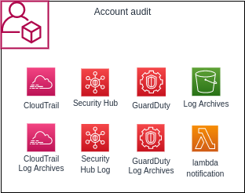

# audit

### The module

This module setup audit and security resources:




+ Guard Duty:
+ Security Hub:
+ Lambda:
+ Events:
+ IAM Roles:
+ S3 Bucket:
+ KMS:
+ SNS:
+ Cloudwatch:

### Applied to stacks
 - audit

## Inputs

| Name | Description | Type | Default | Required |
|------|-------------|------|---------|:--------:|
| enableBucketLogging | Create bucekt for logging access on bucket | `bool` | true | yes |
| region | Region where resources will be created | `string` | n/a | yes |
| orgName | Organization name| `string` | n/a | yes |
| pulumiOrg | Pulumi organization name | `string` | n/a | yes |
| accountNumber | Account id | `string` | n/a | yes |
| trusType | Trust type | `string` | `saml` | yes |
| iamPrincipalARN | IAM arn | `string` | n/a | yes |
| samlProviderARN | Saml provider arn created in root stack | `string` | n/a | yes |
| transitionGlacierDays | Days to move to content to S3 Glacier   |`number` | 90 | yes |
| isSlacklNotification | Enale Slack to send notifications | `string` | n/a | no |
| emailNotification | Email for send notifications | `string` | n/a | no |
| enableGuardDuty | Enable Guard Duty | `string` | `true` | no |
| enablePCI | Enable Security Hub PCI | `string` | `true` | no |
| enableCIS | Enable Security Hub CIS  | `string` | `true` | no |
| enableFoundational | Enable Security Hub Foundational| `string` | `true` | no |
| enableSecurityHub | Enable Security Hub | `string` | `true` | no |
| severityList | List of severity for alerts | `list(string)` | `[]` | yes |
| accounts | Account environment (env,id,email) | `list(object)` | `[]` | yes |
| notification.enable | Enable send notification for guardduty | `bool` | `true` | false |
| notification.endpointType | Type of notification channel (teams, slack, google) | `string` | n/a | false |
| notification.webhookTeams | Teams webhook | `string` | n/a | false |
| notification.webhookGoole | Google Chat webhook | `string` | n/a | false |
| notification.slackChannel | Slack channel | `string` | n/a | false |
| notification.slackChannel | Slack slackToken | `string` | n/a | false |
| notification.logOnly | Log events of guardduty only in cloudwatch and not send any notification | `string` | n/a | false |


## Outputs
| Name | Description |
|------|-------------|
| cloudTrailKmsKeyARN | Shared kms key for use in anothers account for access s3 bucket audit| 


## How use

```shell
git clone ...
npm install
pulumi login #OR export env PULUMI_ACCESS_TOKEN
pulumi stack select <organame/stack-namne>
pulumi up
```

## Author

Module managed by [DNXBrasil](https://dnxbrasil.com).