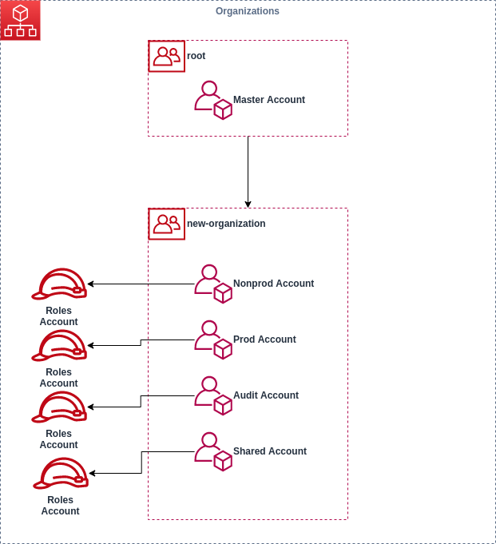
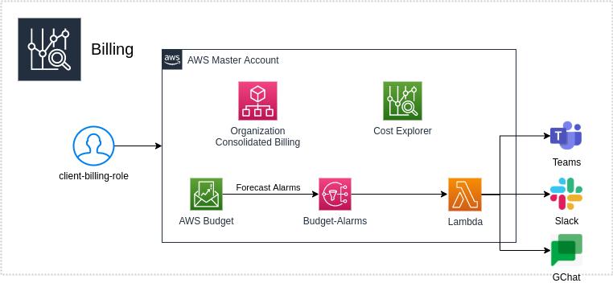

# root

### The module

This module setup Organizations, Accounts and Roles.






The following resources will be created:

+ Organization:  with new name below the master account;
+ Accounts: 
+ IAM User
+ IAM Roles:
+ Budget
+ SNS
+ Lambda
### Applied to stacks
 - root

## Inputs

| Name | Description | Type | Default | Required |
|------|-------------|------|---------|:--------:|
| region | Region where resources will be created | `string` | n/a | yes |
| orgName | Organization name | `string` | n/a | yes |
| orgPulumi | Organization Pulumi name | `string` | n/a | yes |
| orgRole | Organization Role | `string` | n/a | yes |
| organizationRootName | Organization root name | `string` | n/a | yes |
| organizationRootExists | Control  create organizattion if not exists| `bool` | `true` | yes |
| dnxAccount | DNX Account for permission assume role | `string` | n/a | yes |
| extraTrustRelationshipInfraDeploy | Extra trust relation for ec2 shared assume roles |`list(string)` | `[]` | [] |
| budgetAlertlLimitAmount | The amount of cost or usage being measured for a budget    | `string` | `true` | yes |
| createServiceLinkedRoles | If create Service Linked Roles    | `boolean` | `true` | false |
| serviceLinkedRoles | List of service linked role for creation (name,service)   | `list(object)` | `[]` | [] |
| isCreateAccounts | If create accounts or reuse existing | `bool` | `true` | false |
| accounts | List of aws account for reuse (name,account.id) | `list(object)` | `[]` | [] |
| accountsCreate | List of account to create (name, email) |`list(object)` | `[]` | [] |
| createSSO | If create AWS SSO group association | `bool` | `false` | false |
| groupsId | List of AWS SSO Groups per account (account-a: xxxxxxx-xxxx-xxxx-xxxx-xxxxxxxxxxx) | `list(object)` | `[]`| yes |
| permissionSetARN | Default permission for SSO Groups | `string` | `true` | yes |
| notification.enable | Enable send notification for billing | `bool` | `true` | false |
| notification.webhookTeams | Teams webhook | `string` | n/a | false |
| notification.webhookGoole | Google Chat webhook | `string` | n/a | false |
| notification.slackChannel | Slack channel | `string` | n/a | false |
| notification.slackChannel | Slack slackToken | `string` | n/a | false |
| notification.endpointType | Type of notification channel (teams, slack, google) | `string` | n/a | false |


## Outputs
| Name | Description |
|------|-------------|
| accounts | List of account created| 
| orgName | Organization name| 
| orgPulumi | Pulumi Organization name| 


## How use

```shell
git clone ...
npm install
pulumi login #OR export env PULUMI_ACCESS_TOKEN
pulumi stack select <organame/stack-namne>
pulumi up
```

## Author

Module managed by [DNXBrasil](https://dnxbrasil.com).