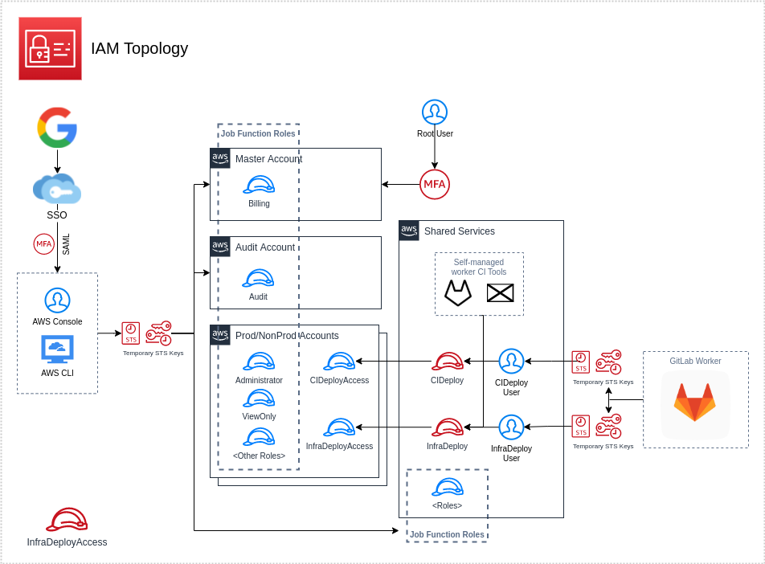

# Identity

### The module

This module setup an Roles and Iam users for CI/CD and AWS console users by SSO SAML.





The following resources will be created:

+ IAM Users:
+ Policies:
+ IAM Roles:

###** Applied to stacks
 - nonprod
 - prod
 - shared

## Inputs

| Name | Description | Type | Default | Required |
|------|-------------|------|---------|:--------:|
| orgName | Organization name | `string` | n/a | yes |
| pulumiOrg | Pulumi organization name | `string` | n/a | yes |
| region | Region where resources will be created | `string` | n/a | yes |
| account |Account Name | `string` | n/a | yes |
| accountNumber |Account id | `string` | n/a | yes |
| roleMaxSessionDuration | Session max duration | `number` | n/a | yes |
| enableRoleJobs | Create IAM role for specfic jobs| `bool` | `true` | yes |
| enableCiDeployRole | Create role for CI deploy | `bool` | `true` | yes |
| enableCiDeployAccess | Create role Ci Deploy Access | `string` | `true` | yes |
| enableIamUser | Create IAM user for CI | `bool` | `true` | yes |
| enableAdminCI | Create Admin Access Policy| `bool` | `true` | yes |
| enableInstanceProfile | Create Instance Profile | `bool` | `true` | yes |
| trustAccountIds | 
List trust accounts wiht permission to assume CIDeployAccess | `list(string)` | n/a | yes |
| trustArns | List trust others arn wiht permission to assume CIDeployAccess | `list(string)` | n/a | yes |

## Outputs
N/A

## How use

```shell
git clone ...
npm install
pulumi login #OR export env PULUMI_ACCESS_TOKEN
pulumi stack select <organame/stack-namne>
pulumi up
```

## Author

Module managed by [DNXBrasil](https://dnxbrasil.com).