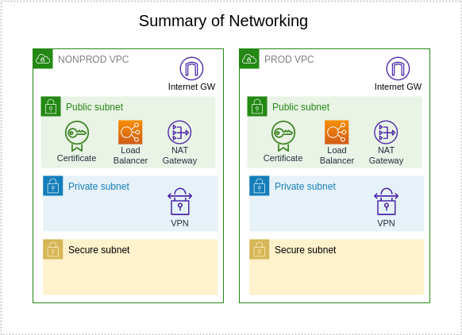
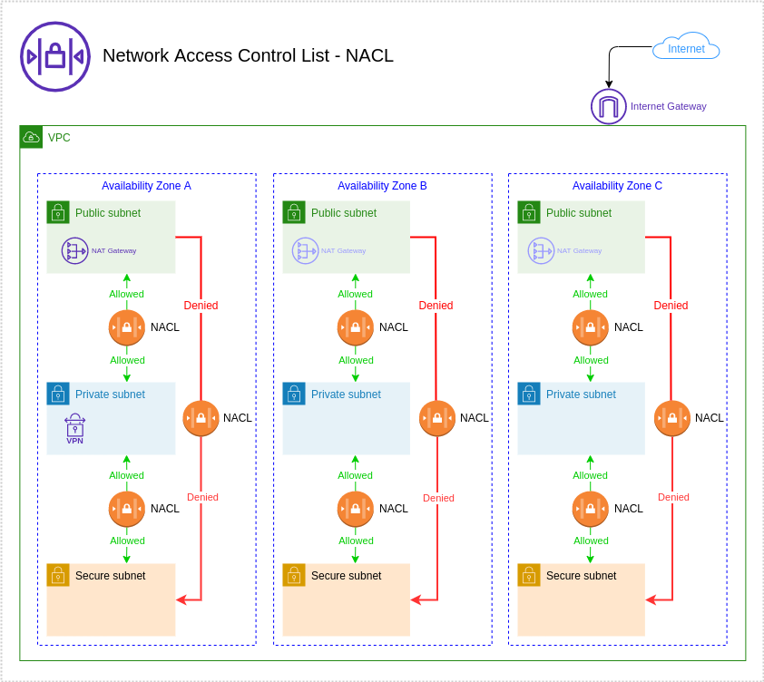

# Network

### The module

This module setup network configuration in account






The following resources will be created:

+ Virtual Private Cloud (VPC)
+ EC2 (createNATGateway = false)
+ VPC Flow Logs
+ AWS Cloudwatch log groups
+ Subnets: 
    + **Public**
    + **Private**
    + **Secure**
+ Internet Gateway
+ Route Table:
    + **Public**
    + **Private**
    + **Secure**
+ Nat Gateway (createNATGateway = true)
+ Elastic IP
+ Network Access Control List (NACL):
    + **Public**
    + **Private**
    + **Secure**
+ VPC endpoint:
    + **S3**
+ Route 53
+ IAM Role:
    + **VPC-flow-logs**

### Applied to stacks
 - nonprod
 - prod
 - shared

## Inputs

| Name | Description | Type | Default | Required |
|------|-------------|------|---------|:--------:|
| orgName | Organization name | `string` | `true` | no |
| pulumiOrg | Organization created at Pulumi Cloud | `string` | n/a | yes |
| region | Region for create resources | `string` | `""` | no |
| account | AWS Account name | `string` | n/a | yes |
| accountNumber | AWS Account number | `string` | n/a | yes |
| eksClusters | List of kubernetes cluster names to creates tags in public and private subnets of this VPC | `list(string)` | `[]` | no |
| maxAz | Max number of AZs | `number` | `3` | no |
| enableMultiNat | Number of NAT Instances, 'true' will yield one per AZ while 'false' creates one NAT | `bool` | `false` | no |
| PublicNaclInboundTCPPorts | TCP Ports to allow inbound on public subnet via NACLs (this list cannot be empty) | `list(string)` | <pre>[<br>  "80",<br>  "443",<br>  "22",<br>  "1194"<br>]</pre> | no |
| PublicNaclInboundUDPPorts | UDP Ports to allow inbound on public subnet via NACLs (this list cannot be empty) | `list(string)` | `[]` | no |
| PrivateNaclInbound | Rules for nacl subnet private intries | `list(string)` | [] | no |  
| cidrBlock | Network CIDR for the VPC | `string` | n/a | yes |
| enableFlowLogs | Enable or disable VPC Flow Logs | `bool` | `true` | no |
| flowLogsRetention | Retention in days for VPC Flow Logs CloudWatch Log Group | `number` | `30` | no |
| PublicZones | Enable make domain on Route 53 | `list(string)` | [] | no |
| PivateZones | Enable Private Zone | `bool` | `true` | no |
| zones | List of host zones | `list(string)` | `true` | no |
| createNatGateway | If make NAT Gateway for account | `bool` | false | yes
| instanceTypesNat | Type instance EC2 for make NAT Hosted | `list(string)` | [] | yes (if CreateNatGateway: false) |
|


## Outputs
| Name | Description |
|------|-------------|
| NS Records | NS Record for each domain created| 
| Subnets | Subnets createds |
| VPC | VPC created for account | 
| ElasticIP | Public IP created |


## How use

```shell
git clone ...
npm install
pulumi login
pulumi stack select <organame/stack-namne>
pulumi up
```

## Author

Module managed by [DNXBrasil](https://dnxbrasil.com).