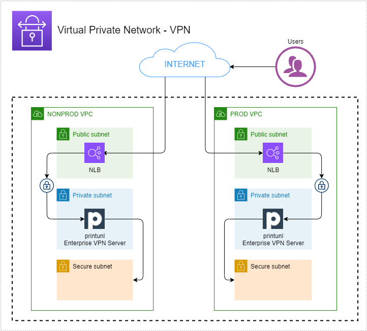

## VPN Pritunl

### The module

This module setup VPN Pritunl:



+ IAM Role

    + **(enviroment)-vpn-role**
+ EC2
    + **pritunl-zero**
+ Load Balancer
+ SSM
    + **pritunl-password**
+ Route 53

### Applied to stacks
 - nonprod
 - prod

## [Inputs](Pulumi.nonprod.yaml)

| Name | Description | Type | Default | Required |
|------|-------------|------|---------|:--------:|
| pulumiOrg | Organization created at Pulumi Cloud | `string` | n/a | yes |
| region | Region where resources will be created | `string` | `us-east-1` | yes |
| domainName | Domain hosted zone account | `string` | n/a | yes |
| account | AWS Account name | `string` | n/a | yes |
| accountNumber | AWS Account number | `string` | n/a | yes |
| useDefaultCertificate | Resources will use the certificate created in Network stack | `bool` | true | yes |
| useDefaultDomain | Resources will use the domain created in Network stack | `bool` | n/a | yes |
| certificateARN | ARN of certificate created in Network stack | `string` | n/a | yes |
| instanceConfig | List configuration for EC2 | `object` | n/a | yes |
| instanceConfig.ingressRules | List of entry rules for SG Configuration | `list(object)` | n/a | yes |
| instanceConfig.ingressRules.name | Name for rule of SG | `string` | "" | yes |
| instanceConfig.ingressRules.fromPort | Origin port range | `number` | 0 | yes | 
| instanceConfig.ingressRules.toPort | Limit port range | `number` | 0 | yes |
| instanceConfig.ingressRules.protocol | Type protocol for rule (TCP, UDP, Any...) | `string` | "-1" | yes |
| instanceConfig.ingressRules.cidrBlocks | Interval IP Range | `list(string)` | ['0.0.0.0/0'] | yes |
| instanceConfig.cloudInitFile | User data for EC2 | `list(object)` | n/a | yes |
| instanceConfig.cloudInitFile.enable | Condition for read user data script | `bool` | true | yes |
| instanceConfig.cloudInitFile.name | File name to be read whe starting EC2 | `string` | linux.tpl | yes |
| instanceConfig.instanceType | Type of instance EC2 | `string` | t3a.micro | yes |
| instanceConfig.keyPar | Key Pair for EC2 | `bool` | false | yes |
| instanceConfig.managedPolicies | Policies default AWS for attach instance EC2 | `list(string)` | AmazonSSMManagedInstanceCore(arn), CloudWatchAgentServerPolicy(arn) | yes |
| instanceConfig.monitoring | Cloudwatch monitoring instance | `string` | "true" | no |
| instanceConfig.name | Instace Name | `string` | pritunl-zero | yes |
| instanceConfig.tags | Tags key-value for EC2 utilities | `object` | key: value | no |
| instanceConfig.volumeSize | EBS Volume size total | `string` | "30" | yes |
| instanceConfig.volumeType | EBS Volume type hardware | `string` | gp3 | yes |
| loadBalance | Make a new loadbalance for VPN | `object` | n/a | yes |
| loadBalance.name | Load Balancer name | `string` | pritunl-zero | no |
| loadBalance.loadBalancerType | LoadBalancer Type to use. Valid values are: network and application | `string` | network | yes |
| loadBalance.enableCrossZoneLoadBalancing | Cross-zone load balancing reduces the need to maintain equivalent numbers of instances in each enabled Availability Zone, and improves your application's ability to handle the loss of one or more instances.  | `bool` | true | no |
| loadBalance.internetAccess | Enable internet connection for LB | `bool` | true | no |
| loadBalance.env | Environment account | `string` | n/a | no |
| loadBalance.ingressRules | Entry rules LB | `list(Object)` | [] | no |
| loadBalance.targets | Targets | `list(object)` | [] | no |


## Outputs
| Name | Description |
|------|-------------|
| vpnSecurityGroupVPN | Security Group arn | 


## How use

```shell
git clone ...
npm install
pulumi login
pulumi stack select <organame/stack-namne>
pulumi up
```

## Author

Module managed by [DNXBrasil](https://dnxbrasil.com).
