# Arquitetura DNX Foundation
## Introdução

Toda a infraestrutura implantada via **DNX Foundation** é disponibilizada como código, dividido por stacks. Cada stack tem seu pipeline, facilitando alterações e deploy de parâmetros e/ou personalizações.

Para o cliente **{{ CLIENT_NAME }}**, os códigos da Foundation encontram-se no repositório do **{{ GIT_TYPE }}** acessado através do endereço: {{ GIT_LINK }}.

Em uma visão macro de toda a infraestrutura configurada na AWS, a figura a seguir ilustra a organização das contas, VPCs e subnets, bem como  onde os serviços estão implantados

<p align="center">
  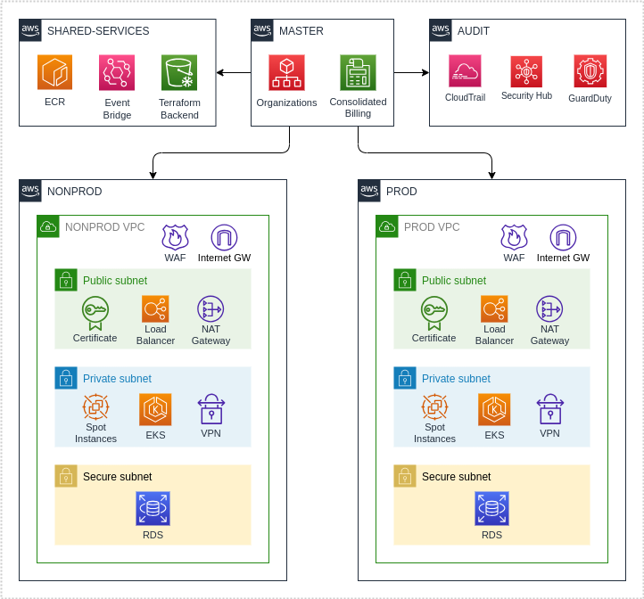
</p>


### repositórios de IaC

Abaixo segue uma breve descrição de cada repostorio de IaC:

- **aws-root**: responsável pela criação da organização e das contas;
- **audit**: responsável pela criação e configuração os serviços de auditoria e segurança, Cloudtrail, Security Hub e Guard Duty;
- **baseline**: responsável pelo aceite e configuração do Security Hub, Guard Duty como também a notificação destes eventos;
- **identity**: responsável pela criação e configuração de roles de acessos
- **network**: responsável pela criação e configuração das VPC,Subnets, ACL e Dominios do ambiente;
- **utilities**: responsável pela criação e configuração dos repositórios ECR, AWS Backup e certificados(ACM);
- **vpn-pritunl**: responsável pela criação e configuração da VPN Pritunl;

- **app-ecs**: responsável pela criação dos cluster ECS e aplicações, assim como outros recursos de workload e storage(EC2,RDS,REDIS,etc..)

- **app-eks**: responsável pela criação dos cluster EKS, assim como outros recursos de workload e storage(EC2,RDS,REDIS,etc..);
- **eks-postinstall**: responsável pela configuração de demais ferramentas necessarias para o funcionamento do kubernetes;


### Estrutua de configuração das Stacks Pulumi

Todas as stack do pulumi, possuem um padrão de arquivo de configuração, seguindo este padrão:

> Pulumi.**ambiente**.yaml

<p align="center">
  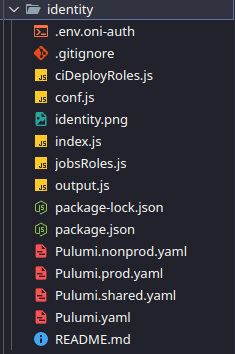
</p>


Neste arquivo, ha configurações basicas referente a cada stack. Também ha em algumas stacks um diretorio chamado **inputs/ambiente**, nele ha a definição de criação de recursos, por exemplo, instancias de RDS ou S3.

<p align="center">
  
</p>


### Contas

Foram criadas quatro contas  a partir da conta principal (Master)  para segregar os serviços na nuvem da AWS. São elas:

|AWS Account  | Account ID |Descrição
|--|--|--|
| {{ ACCOUNT_NAME_MASTER }} | {{ ACCOUNT_ID_MASTER }} | {{ DESCRIPTION_MASTER }}|
| {{ ACCOUNT_NAME_AUDIT }} | {{ ACCOUNT_ID_AUDIT }} | {{ DESCRIPTION_AUDIT }}|
| {{ ACCOUNT_NAME_SERVICES }} | {{ ACCOUNT_ID_SERVICES }} | {{ DESCRIPTION_SERVICES }}|
| {{ ACCOUNT_NAME_NONPROD }} | {{ ACCOUNT_ID_NONPROD }} | {{ DESCRIPTION_NONPROD }}|
| {{ ACCOUNT_NAME_PROD }} | {{ ACCOUNT_ID_PROD }} | {{ DESCRIPTION_PROD }}|

## Cobranças

Todos os serviços que rodam nas contas são sumarizados na conta **{{ ACCOUNT_NAME_MASTER }}** ({{ ACCOUNT_ID_MASTER }}). É possível configurar os serviços para alertar, via Slack, Teams ou Google, quando os custos estão acima de um valor pré-determinado. A figura abaixo ilustra os componentes envolvidos neste processo:

<p align="center">
  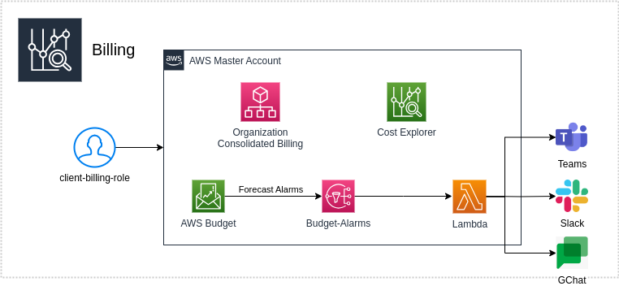
</p>


## SSO e Identidades
O gerenciamento dos acessos aos recursos, não importando a conta que está implantado, é todo controlado via **role**, com autenticação centralizada no IAM. Se necessário  poderá ser configurado o acesso a AWS pelo AWS IAM Identity Center, logo, os usuários que podem acessar os recursos na nuvem precisam ser permitidos e associados a determinados grupos, os quais são aceitos via Single Sign-On (SSO), através de federação SAML.

A Foundation define um conjunto de configurações do IAM (Identity and Access Management) nas contas da AWS para aplicar o conceito _least privilege_ e prover exatamente a _policy_ necessária para usuários e sistemas.

<p align="center">
  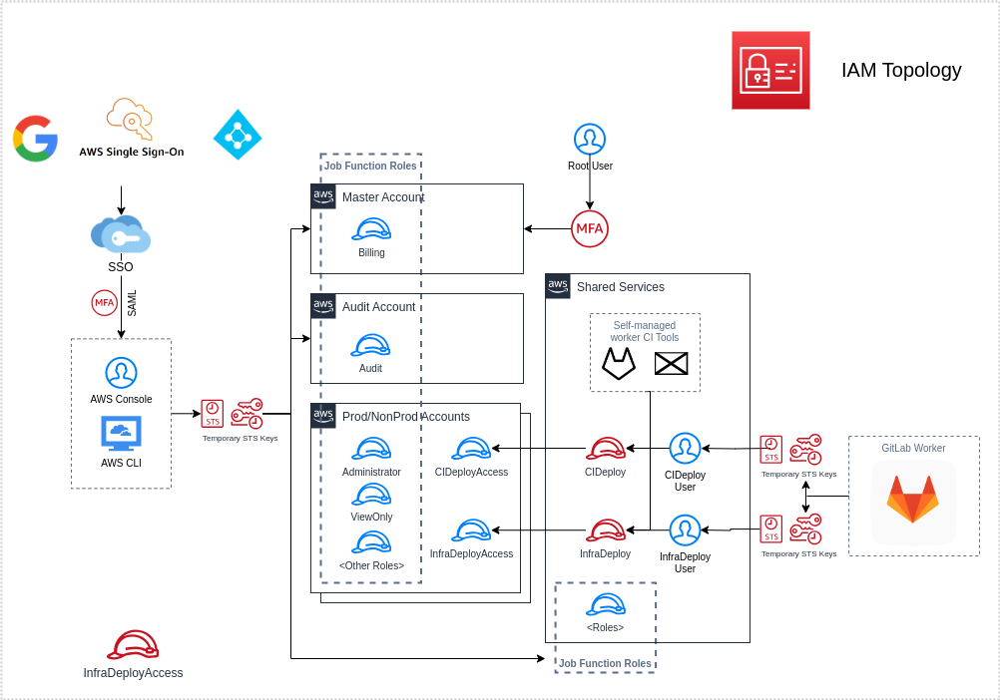
</p>


## Domínios

Todos os nomes de domínio passam a ser identificados por subdomínios delegados ao serviço **Route53** da AWS e seguem o padrão mostrado na figura a seguir.

Os domínios DNS da conta de nonprod e prod tem um Certificado  gerenciado pelo **AWS Certificate Manager**  que é emitido conforme o padrão estipulado para os subdomínios.

| AWS Account | Subdomain |
|--|--|
| {{ ACCOUNT_NAME_NONPROD }}  | {{ SUBDOMAIN_NONPROD }} |
| {{ ACCOUNT_NAME_PROD }}  | {{ SUBDOMAIN_PROD }} |
|    {{ ACCOUNT_NAME_SERVICES }}   |   {{ SUBDOMAIN_SHARED }}    |

<p align="center">
  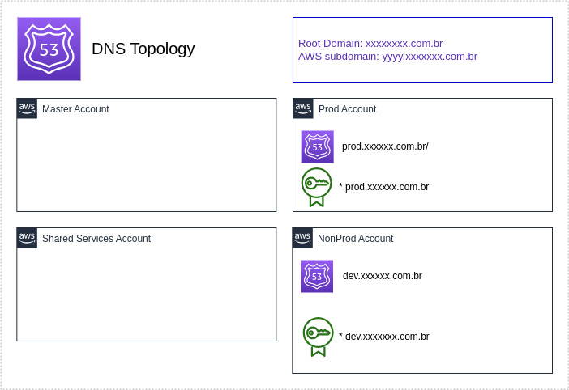
</p>

## Rede

As VPCs dos ambientes produtivo, não-produtivo e shared-services são separadas, e cada uma possui três camadas de subnets, conforme apresentado na figura a seguir.

<p align="center">
  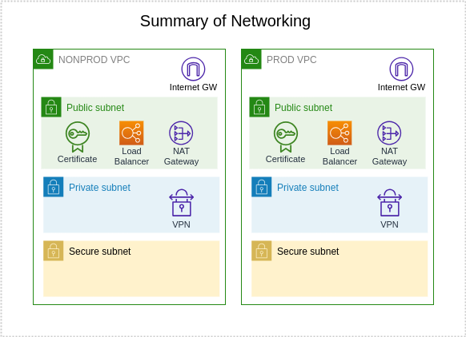
</p>


A saída de Internet é provisionada a partir do serviço **AWS NAT Gateway** que permite a comunicação entre a Internet e os recursos que estão na subnet privada.  Para esses três ambientes foi disponibilizado 01 NAT Gateway a partir de 01 zona de disponibilidade (AZ).

A tabela a seguir mostra as faixas de endereços IPs locais para cada conta, bem como a quantidade de NAT Gateways:

| AWS Account | CIDR | NAT Gateway |
|--|--|--|
| {{ ACCOUNT_NAME_SERVICES }} | {{ NAT_GATEWAY_CIDR_SERVICES }} | Quantidade: 1 |
| {{ ACCOUNT_NAME_NONPROD }} | {{ NAT_GATEWAY_CIDR_NONPROD }} | Quantidade: 1 |
| {{ ACCOUNT_NAME_PROD }} | {{ NAT_GATEWAY_CIDR_PROD }}   | Quantidade: 1 |

E na próxima tabela estão listados os endereços IPs públicos de saída que estão alocados em cada ambiente:

| AWS Account | Public IP |
|--|--|
| {{ ACCOUNT_NAME_SERVICES }}| {{ PUBLIC_IP_SERVICES }} |
| {{ ACCOUNT_NAME_NONPROD }}| {{ PUBLIC_IP_NONPROD }} |
| {{ ACCOUNT_NAME_PROD }}| {{ PUBLIC_IP_PROD }}|

## Subnets

Cada VPC possui subnets criadas para gerenciar o tráfego de rede internamente e aplicar uma camada robusta de segurança usando os conceitos de defesa com profundidade.

Somente a subnet privada tem acesso a subnet pública e a subnet segura. A subnet pública **não** acessa a subnet segura. A comunicação entre subnets é controlada por regras de rotas e NACLs (Networking Access Control List). Esta implementação tem foco em segurança e por regra nega tráfegos não autorizados entre subnets.

| **Subnet Layer** |  **Description**|
|--|--|
| Public | Esta camada é de acesso público, tipicamente todos os recursos aqui tem um endpoint público. AWS Load Balancers e AWS NAT Gateways são implantados nesta camada. |
| Private | Subnets privadas não são de acesso público, apenas as subnets pública e segura podem acessar esta camada. Todas as requisições de saída são roteadas por NATs implantados na camada pública. Os recursos de aplicação devem ser implantados nesta camada. |
| Secure | As subnets seguras não são publicamente acessíveis, é acessível apenas pela subnet privada e é a camada ideal para os serviços de armazenamento. |

<p align="center">
  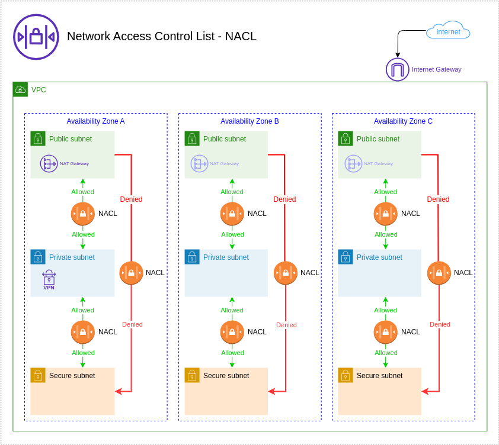
</p>




## VPN Pritunl

A **DNX Foundation** requer uma conexão VPN (Virtual Private Network) para permitir acesso a todas as camadas de rede.

Para acessar os recursos que não têm acesso público é disponibilizado um serviço de VPN através do servidor **Printunl** implantado nas contas do ambiente produtivo e não-produtivo, o qual possui roteamento entre todas as subnets.

A conexão com o servidor VPN requer chaves individuais e MFA (Multi Factor Authentication). A figura a seguir apresenta detalhes da topologia da VPN.

<p align="center">
  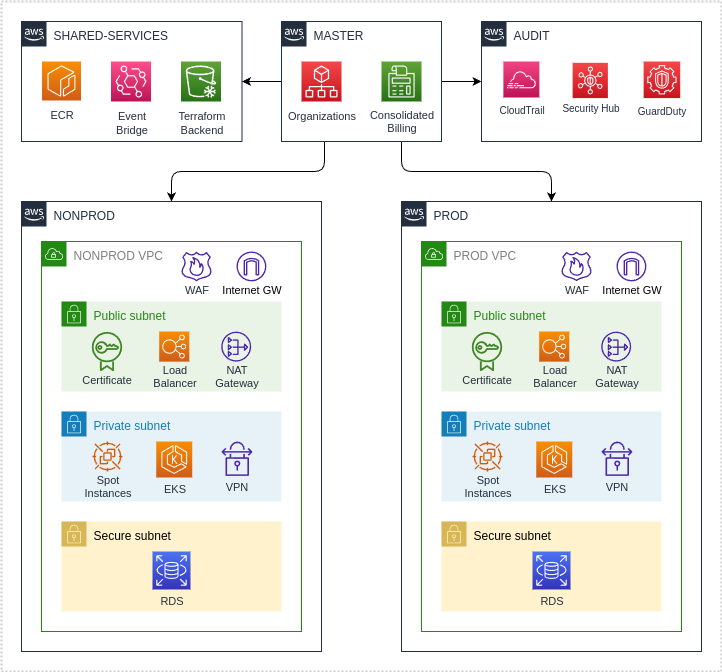
</p>

 




## Pritunl Zero

Para acessar os recursos que não têm acesso público é disponibilizado um serviço de Zero trust através do servidor **Printunl Zero** implantado nas contas do ambiente produtivo e não-produtivo, o qual possui proxy para acessar aplicações e api que estejam privadas.

 


<p align="center">
  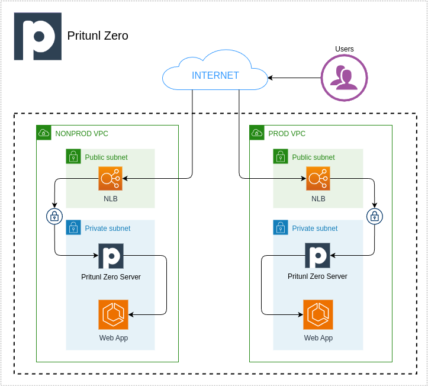
</p>



## Kubernetes (EKS)

A infraestrutura de container disponibilizada utiliza Kubernetes como base (EKS versão 1.26), no qual os nodes do cluster são dispostos em zonas de disponibilidade, com autoscale implementado. 
O acesso às aplicações do cluster se dá via AWS ALB Ingress Controller, no qual um load balancer do tipo ALB é implantado na subnet pública, que faz acesso aos serviços na subnet privada, onde os nodes do cluster foram implantados. Os acessos via load balancer são seguros via certificados, que são gerados via ACM para cada conta. 
Um Node Group com instâncias do tipo spot são disponibilizados inicialmente, porém outros podem ser adicionados posteriormente para caso de ondemand.

<p align="center">
  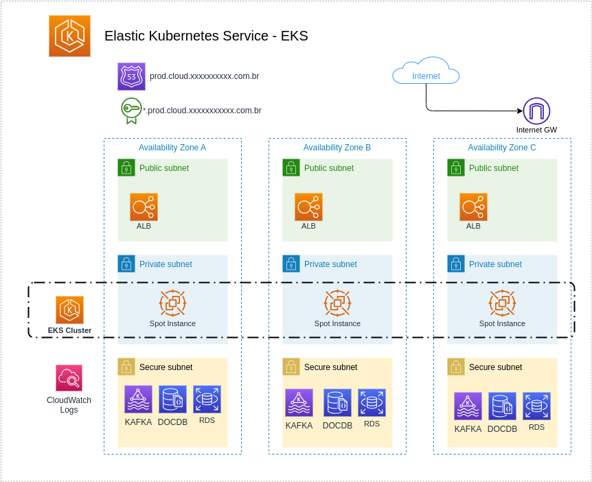
</p>


## Ferramentas instaladas no cluster EKS

Abaixo temos uma imagem ilustrativa das principais ferramentas implementadas no cluster com o objetivo de apoiar o ambiente, seja em monitoramento ou funcionamento:

<p align="center">
  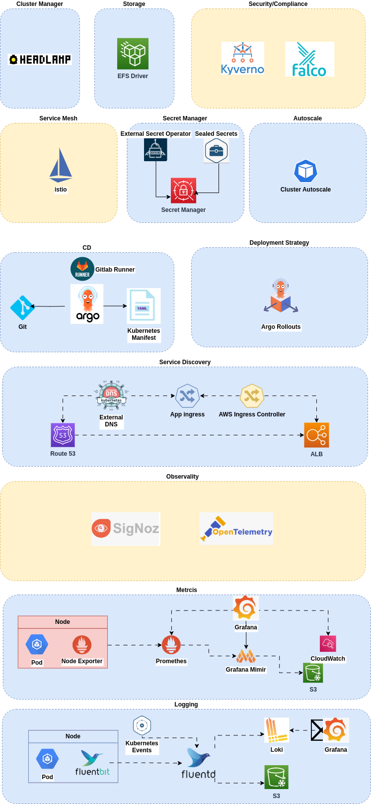
</p>


- ### Headlamp 
O Headlamp é uma interface web projetada para simplificar a gestão e visualização de clusters Kubernetes. Ela fornece um painel amigável que permite que desenvolvedores e operadores naveguem facilmente pelos seus recursos Kubernetes, como pods, implantações, serviços e namespaces.

- ### ArgoCD 

Argo CD é a ferramenta de CD que utiliza a abordagem GitOps e realiza a sincronização dos manifestos de uma aplicação após o build dela no GitLab/Github/Bitbucket. A aplicação também mantém um histórico de versões, que permite facilmente realizar o rollback da aplicação para uma versão anterior. A ferramenta também pode ser configurada para realizar autenticação via SSO.

- ### ArgoRollouts
O ArgoRollouts permite que seja possível fazer releases usando as estratégias blue/green e canary.

- ### Prometheus
O prometheus é a ferramenta responsável realizar a coleta de métricas(CPU, Memoria, Rede, etc) do cluster(Nodes, Pods, etc) e armazenamentos dessas informações.

- ### Grafana loki
Similar a ferramenta prometheus, porém voltadas para armazenamento de logs, utilizando uma sintaxe próxima ao do prometheus, para realizar as consultas em sua base de dados.

- ### Fluentd (Banzai Logging)
Ferramenta que realiza a captura dos logs, no qual ela envia esses logs para serem armazenados no Grafana Loki e também realiza uma cópia desses logs para o S3, para caso o cluster EKS não esteja disponível para visualização.

- ### Event Tailer (Kubernetes Events)
Utilitário para capturar o eventos do kubernetes e armazena-los tanto no Grafana Loki como no S3. 

- ### Grafana
Ferramenta para visualização das métricas coletadas pelo prometheus, como também os logs do Grafana Loki. O Grafana também é usado para visualizar as métricas do Cloudwatch da AWS. Dashboards default são entregues para visualização dessas informações.

- ### Grafana Mimir
O Grafana Mimir é uma ferramenta para retenção de longo prazo para o Prometheus usando o S3 como storage. Por padrão esta ferramenta não é implementada, devido a requerer um uso de recurso significativo, mas pode ser habilitada.

- ### Signoz + OpenTelemetry
Ferramentas para realizar a observalidade das aplicações, através de traces, funcionamento similar a um APM, realizando a auto-instrumentação da aplicação, sem necessidade de alterar o código dela(Node, Python, Java, Golang, .Net Core).  Por padrão esta ferramenta não é implementada, devido a requerer um uso de recurso significativo, mas pode ser habilitada.


- ### AWS ALB Ingress Controller + External DNS
O ingress utilizado no EKS, é um próprio da AWS, que facilita a interação com o serviços do ambiente, permitindo a criação de Load Balancers e cadastro de targets. O External DNS, realizar o cadastro das entradas de host do ingress, no Route 53 de forma automática.

- ### Canary Checker
Ferramenta para realizar healthchecks em endpoints, como tambem resultados de testes de carga com Grafana k6. Também é possivel realizar queries em banco de dados para gerar alertas.

- ### Istio
Serviço de service mesh, não implementado por padrão.

- ### Cluster Autoscale
Realiza o auto escalonamento dos nodes do cluster quando necessário.

- ### EFS Driver
Disponibiliza um storage class que faz uso do EFS da AWS, permitindo que qualquer node do cluster faça uso dele quando necessário.


- ### Kyverno + Falco
A ferramenta Kyverno é utilizada para criar regras dentro do kubernetes, forçando a seguir certos padrões de boas práticas, enquanto a ferramenta Falco realiza um constante escaneamento das ações que ocorrem no kubernetes, sinalizando possíveis problemas de segurança. Ambas as ferramentas não são habilitadas por padrão.


# URL dos Serviços

## Headlamp

 - **Nonprod:** {{ RANCHER_URL_NONPROD }}
 - **Prod:**  {{ RANCHER_URL_PROD }}

## Argo CD

 - **Nonprod:** {{ ARGOCD_URL_NONPROD }}
 - **Prod:** {{ ARGOCD_URL_PROD }}

 ## Grafana

 - **Nonprod:** {{ GRAFANA_URL_NONPROD }}
 - **Prod:** {{ GRAFANA_URL_PROD }}

 ## Canary Checker

 - **Nonprod:** {{ CANARY_URL_NONPROD }}
 - **Prod:** {{ CANARY_URL_PROD }} 

 ## VPN Pritunl

  - **Nonprod:** {{ VPN_URL_NONPROD}}
 - **Prod:** {{ VPN_URL_PROD }}


  


## Elastisc Container Service (ECS)


A infraestrutura de container disponibilizada utiliza o Elastic Container Service(ECS), no qual os nodes do cluster são dispostos em zonas de disponibilidade, com autoscale implementado. 
O acesso às aplicações do cluster se dá via Load Balance do tipo application, que é implantado na subnet pública, que faz acesso aos serviços na subnet privada, onde os nodes do cluster foram implantados. Os acessos via load balancer são seguros via certificados, que são gerados via ACM para cada conta. 
Os Nodes do cluster são do tipo spot disponibilizados inicialmente, porém outros podem ser adicionados posteriormente para caso de ondemand.

<p align="center">
  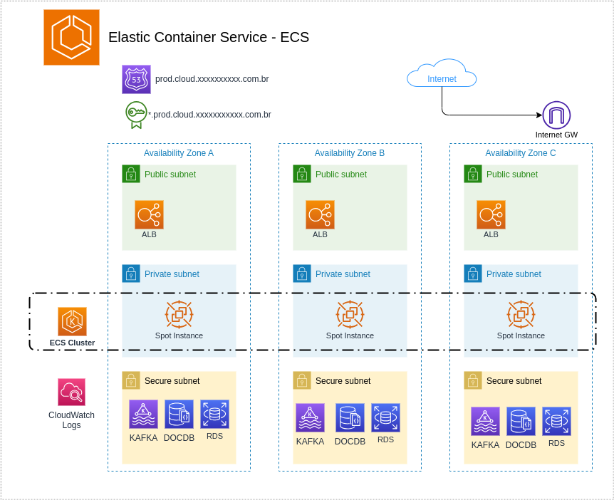
</p>


 

# Otimização de custos

A otimização de custos, envolve a utilização de instâncias SPOTs na disponibilização das máquinas do cluster ECS ou EKS, que podem reduzir os custos em até 70%. É utilizada também a estratégia de desligar recursos fora do horário de trabalho do cliente, através de uma scheduler.

<p align="center">
  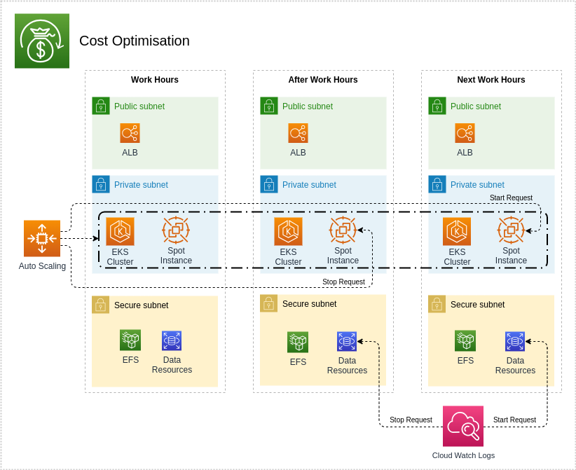
</p>


Como todo o ambiente é provisionado com infraestrutura como código(IaC), é possível destruir e criar o ambiente em alguns minutos, esta ideia é útil para casos de alguns recursos que não podem ser parados, é apenas destruídos, a exemplo, o Elasticache(Redis).

# Pipeline de Infraestrutura

A imagem abaixo apresenta o workflow do pipeline de infraestrutura para cada stack/repositório dos projetos  no Git do cliente.


<p align="center">
  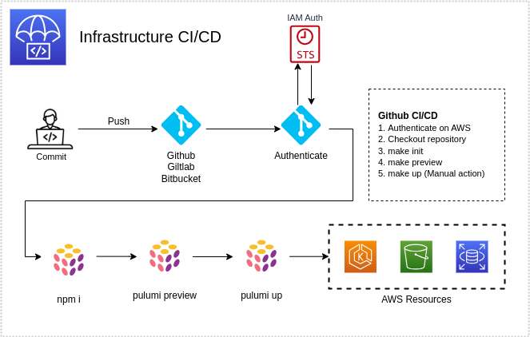
</p>




## Github Actions

#### Arquivo infrastructure.yaml
```yaml
on:
name: Pulumi action

on:
  workflow_dispatch:
    inputs:
      environment:
        required: true
        type: choice
        description: "Select environment"
        options:
          - nonprod
          - prod
          - audit
          - shared

      directory:
        required: true
        type: choice
        description: "Select directory"
        options:
          - audit
          - identity
          - baseline
          - network
          - utilities
          - vpn-pritunl
          - pritunl-zero
          - app-ecs

      commands:
        required: true
        type: choice
        description: "Pulumi command"
        options:
          - preview
          - up
 
env:
  ACCOUNT_PROD: "079910999382"
  ACCOUNT_NONPROD: "138062249233" 
  ACCOUNT_AUDIT: "049229311499"
  ACCOUNT_SERVICE: "298685518555"

jobs:
  iac-action:
    runs-on: ubuntu-latest

    steps:
      - name: Check out the repo
        uses: actions/checkout@v4
        with:
          ref: main

      - name: Set AWS Account ID based on environment
        id: account
        run: |
          case "${{ inputs.environment }}" in
            prod)
              echo "ACCOUNT_ID=${ACCOUNT_PROD}" >> $GITHUB_ENV ;;
            nonprod)
              echo "ACCOUNT_ID=${ACCOUNT_NONPROD}" >> $GITHUB_ENV ;;
            audit)
              echo "ACCOUNT_ID=${ACCOUNT_AUDIT}" >> $GITHUB_ENV ;;
            services)
              echo "ACCOUNT_ID=${ACCOUNT_SERVICE}" >> $GITHUB_ENV ;;
          esac

      - name: Configure AWS Credentials
        uses: aws-actions/configure-aws-credentials@v4
        with:
          aws-access-key-id: ${{ secrets.AWS_ACCESS_KEY_ID_TMP }}
          aws-secret-access-key: ${{ secrets.AWS_SECRET_ACCESS_KEY_TMP }}
          aws-region: ${{ secrets.AWS_REGION_TMP }}
          role-to-assume: arn:aws:iam::${{ env.ACCOUNT_ID }}:role/InfraDeployAccess
          role-session-name: pulumi-${{ inputs.environment }}

      - name: Install packages
        working-directory: ${{ inputs.directory }}
        run: npm install

      - name: Run Pulumi
        uses: pulumi/actions@v6
        with:
          command: ${{ inputs.commands }}
          stack-name: ${{ inputs.environment }}
          work-dir: ${{ inputs.directory }}
        env:
          PULUMI_ACCESS_TOKEN: ${{ secrets.PULUMI_ACCESS_TOKEN }}

```


O arquivo "action.yaml" permite executar o pipeline do Pulumi, com as ações de **preview** e **up**. A ação pode ser acessada através da pagina do projeto do Github:

<p align="center">
  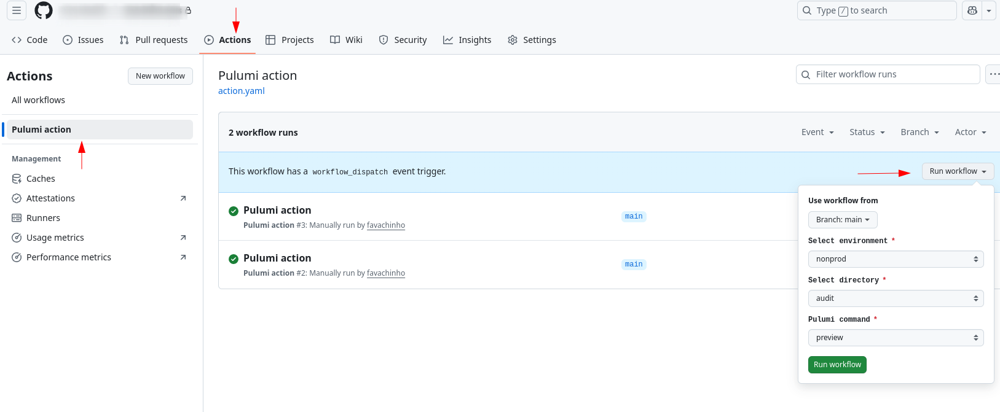
</p>

Ao clicar em Run Workflow, sera necessario escolher qual stack do pulumi deseja aplicar, ambiente e comando.
  



## Bitbucket pipeline

```yaml 
definitions:
  services:
    docker:
      image: "docker:dind"
pipelines:
  branches:
    master:
      - step:
          runs-on:
            - "self.hosted"
            - "linux"
            - "shared"
          name: "preview-nonprod"
          image: "dnxbrasil/pulumi:3.40.0"
          script:
            - export ENVIRONMENT_STACK="nonprod"
            - make  init
            - make  preview
          services:
            - "docker"
          caches:
            - "docker"
      - step:
          runs-on:
            - "self.hosted"
            - "linux"
            - "shared"
          name: "preview-prod"
          image: "dnxbrasil/pulumi:3.40.0"
          script:
            - export ENVIRONMENT_STACK="prod"
            - make init
            - make preview
          services:
            - "docker"
          caches:
            - "docker"            
      - parallel:
          steps:            
            - step:
                runs-on:
                  - "self.hosted"
                  - "linux"
                  - "shared"
                name: "apply-nonprod"
                image: "dnxbrasil/pulumi:3.40.0"
                trigger: "manual"
                script:
                  - export ENVIRONMENT_STACK="prod"                
                  - make  init
                  - make up
                services:
                  - "docker"
                caches:
                  - "docker"
            - step:
                runs-on:
                  - "self.hosted"
                  - "linux"
                  - "shared"
                name: "apply-prod"
                image: "dnxbrasil/pulumi:3.40.0"
                trigger: "manual"
                script:
                  - export ENVIRONMENT_STACK="prod"  
                  - make init
                  - make up
                services:
                  - "docker"
                caches:
                  - "docker"
```

O pipeline é composto de duas partes, sendo a primeira, responsável por realizar o preview, com as mudanças solicitadas, ela executará automaticamente após cada push no repositório de infraestrutura. A segunda parte o apply, realiza a aplicação das mudanças no ambiente, esta parte é executada de maneira manual, é deve ser acionada após verificar o output do passo anterior, para confirmar se as mudanças que ele irá realizar no ambiente, estão de acordo com as solicitadas.



## Gitlab pipeline


```yaml
# image:
#   name: public.ecr.aws/dnxbrasil/pulumi:3.40.0
#   entrypoint: ['']

services:
  - public.ecr.aws/docker/library/docker:19.03.14-dind

variables:
  DOCKER_HOST: tcp://docker:2375
  DOCKER_DRIVER: overlay2

stages:
  - plan
  - apply

# NONPROD
plan-nonprod:
  stage: plan
  when: on_success
  tags: [xxxxx-infra-runner, docker]
  variable:
    ENVIRONMENT_STACK: "nonprod"
    PULUMI_ACCESS_TOKEN: $PULUMI_ACCESS_TOKEN
  script:
    - make init
    - make  preview

apply-nonprod:
  stage: apply
  needs: ["plan-nonprod"]
  when: manual
  tags: [xxxxx-infra-runner, docker]
  variable:
    ENVIRONMENT_STACK: "nonprod"
    PULUMI_ACCESS_TOKEN: $PULUMI_ACCESS_TOKEN
  script:
    - make init
    - make up


# PROD
plan-prod:
  stage: plan
  when: on_success
  tags: [xxxxx-infra-runner, docker]
  variable:
    ENVIRONMENT_STACK: "prod"
    PULUMI_ACCESS_TOKEN: $PULUMI_ACCESS_TOKEN  
  script:
    - make init
    - make  perview

apply-prod:
  stage: apply
  needs: ["plan-prod"]
  when: manual
  tags: [xxxxx-infra-runner, docker]
  variable:
    ENVIRONMENT_STACK: "prod"
    PULUMI_ACCESS_TOKEN: $PULUMI_ACCESS_TOKEN  
  script:
    - make init
    - make  up

```


O pipeline é composto de duas partes, sendo a primeira, responsável por realizar o preview, com as mudanças solicitadas, ela executará automaticamente após cada push no repositório de infraestrutura. A segunda parte o apply, realiza a aplicação das mudanças no ambiente, esta parte é executada de maneira manual, é deve ser acionada após verificar o output do passo anterior, para confirmar se as mudanças que ele irá realizar no ambiente, estão de acordo com as solicitadas.




# Pipeline de Aplicação




A imagem abaixo apresenta o workflow do pipeline para as aplicações ECS com ArgoCD.

<p align="center">
  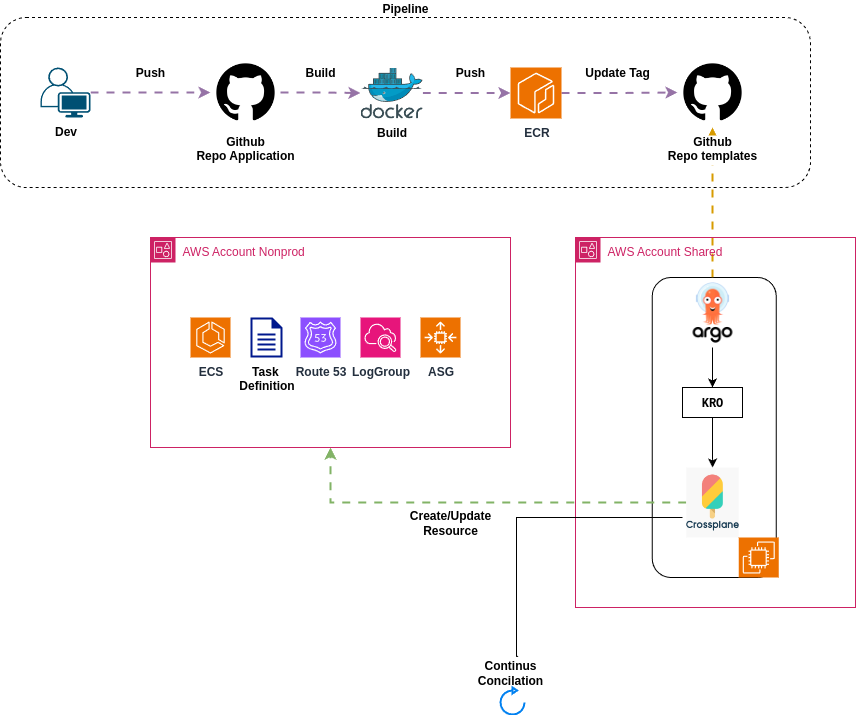
</p>
  
O pipeline contem os seguintes passos:

- Build da aplicação com docker;
- Push para o ECR;
- Clone(Pull) do repositorio com manifestos;
- Atualização da tag da imagem;
- Push dos repositorio de manifestos;
- O ArgoCD verifica as mudanças realizadas no manifesto, sejam elas via pipeline ou manualmente e aplica elas na conta destino, criando os recursos do ECS;


Pipeline:



```yaml
name: Deploy to Amazon ECR

on:
  push:
    branches:
      - dnx

env:
  AWS_REGION: sa-east-1
  AWS_REGISTRY: 000000000000.dkr.ecr.sa-east-1.amazonaws.com
  MANIFEST_REPO: Org/repo-manifest
  ENVIRONMENT: ${{ github.ref_name == 'main' && 'prod' || 'nonprod'  }}

jobs:
  build:
    name: Build
    runs-on: ubuntu-latest
    outputs:
      SHA_SHORT: ${{ steps.vars.outputs.sha_short }}    
    steps:
      - name: Checkout repository
        uses: actions/checkout@v4

      - name: Set up Docker Buildx
        uses: docker/setup-buildx-action@v3

      - name: Log in to the Container registry
        uses: docker/login-action@v3
        with:
          registry: ${{ env.AWS_REGISTRY }}
          username: ${{ secrets.AWS_KEY_SHARED }}
          password: ${{ secrets.AWS_SECRET_SHARED }}

      - name: Extract metadata (tags, labels) for Docker
        id: meta
        uses: docker/metadata-action@v5
        with:
          images: ${{ env.AWS_REGISTRY }}/${{ github.repository }}
          tags: |
            type=sha,enable=true,prefix=
            type=ref,enable=true,priority=600,prefix=,suffix=,event=branch
            type=raw,value=latest,priority=1000,enable={{is_default_branch}}

      - name: Build and push base image
        uses: docker/build-push-action@v6
        with:
          file: "./Dockerfile"
          context: .
          push: true
          tags: ${{ steps.meta.outputs.tags }}
          labels: ${{ steps.meta.outputs.labels }}
          #cache-from: type=gha
          #cache-to: type=gha,mode=max


      - name: Set outputs
        id: vars
        run: echo "sha_short=$(git rev-parse --short HEAD)" >> $GITHUB_OUTPUT
         

  argocd:
      name: Deploy
      needs: build
      runs-on: ubuntu-latest         
      steps:  
      - name: Check out Argo Manifests
        uses: actions/checkout@v3.6.0
        with:
          repository: ${{ env.MANIFEST_REPO }}
          ref: main
          token: ${{ secrets.ARGOCD_TOKEN }}        

      - name: Install yq
        run: |
          VERSION=v4.15.1  # Substitua pela versão mais recente, se necessário
          wget https://github.com/mikefarah/yq/releases/download/${VERSION}/yq_linux_amd64 -O /usr/local/bin/yq
          chmod +x /usr/local/bin/yq          

      - name: Update image deployment
        run: |
          export IMAGE_TAG=${{ needs.build.outputs.SHA_SHORT }} 
          export IMAGE=${{ env.AWS_REGISTRY }}/${{ github.repository }}:$IMAGE_TAG
          yq e '.spec.image = strenv(IMAGE)' -i ${{ env.ENVIRONMENT }}/apps/${{ github.repository }}/app.yaml
          yq e '.spec.hash = strenv(IMAGE_TAG)' -i ${{ env.ENVIRONMENT }}/apps/${{ github.repository }}/app.yaml

      - name: Commit & Push Argo
        uses: actions-js/push@master
        with:
          github_token: ${{ secrets.ARGOCD_TOKEN }}
          repository: ${{ env.MANIFEST_REPO }}
          branch: main          

```



## Componentes ArgoCD
  - **ArgoCD:** ferramenta que realiza o Continus Deploy;
  - **Crossplane:** ferramenta que criar recursos na aws, baseado em manifestos(yaml) do kubernetes;
  - **KRO:** utilitario para criar template, agrupando a criação de varios recursos;
  - **K3s:** versão simples do kubernetes, com menos recursos, ideais para setups simples, dispositivos Iot e ARM.





A imagem abaixo apresenta o workflow do pipeline para as aplicações ECS.

<p align="center">
  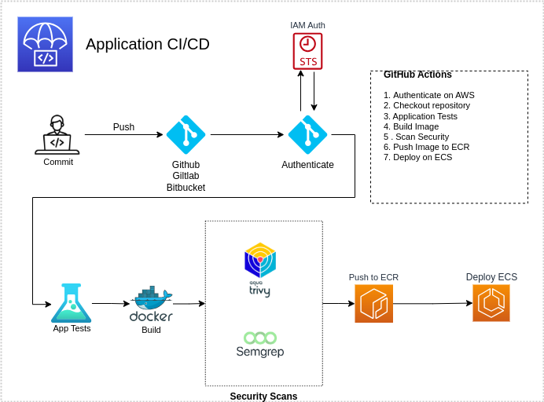
</p>
  
A pipeline de aplicação contém os seguintes passos:

  - Teste de aplicação (opcional, isso é caso o cliente ja possua);
  - Build da imagem da aplicação;
  - Scans de seguração que inclui:
      - **Semgrep**: é uma ferramenta SAST(Static Application Security Testing) para análise de codigo;
      - **Trivy**: é uma ferramenta para análise de vulnerabilidade, que contém scans de:
              - Container image
              - FileSystem
              - Git Repository
  - Push da imagem para o repositório de imagens no ECR da conta shared
  - Deploy da aplicação no ECS



### Github action 



> to do....



> to do....




Para o deploy do ECS, é utilizada a estratégia Blue/Green, que disponibiliza uma url temporária para testar a aplicação, e caso esta esteja respondendo de maneira correta, é realizada a troca para a nova versão

<p align="center">
  
</p>




A imagem abaixo apresenta o workflow do pipeline para as aplicações EKS.

<p align="center">
  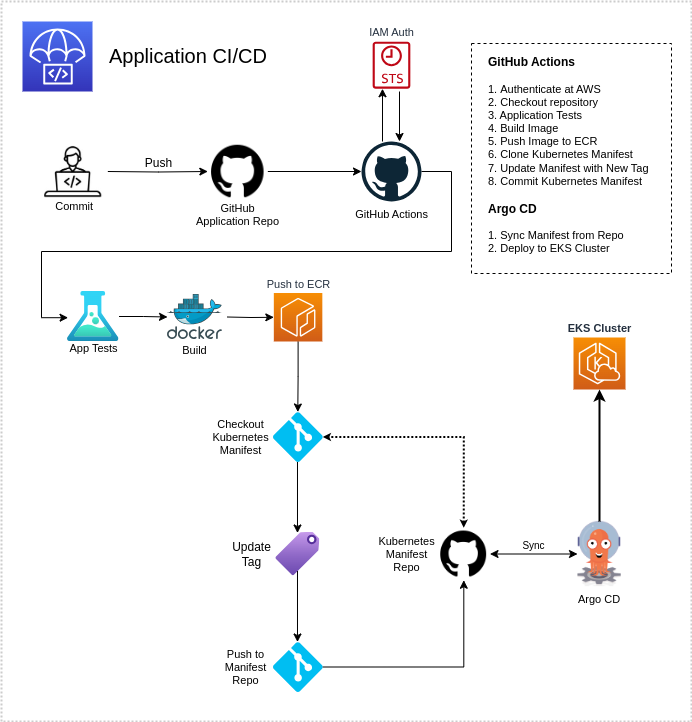
</p>


A pipeline de aplicação é divido em duas partes, sendo a primeira resposavel pelo CI que consiste em:

  - Teste de aplicação (opcional, isso é caso o cliente ja possua);
  - Build da imagem da aplicação;
  - Scans de seguração que inclui:
      - **Semgrep**: é uma ferramenta SAST(Static Application Security Testing) para análise de código;
      - **Trivy**: é uma ferramenta para análise de vulnerabilidade, que contem scans de:
              - Container image
              - FileSystem
              - Git Repository
  - Push da imagem para o repositório de imagens no ECR da conta shared;
  - Clone de repositório contem os manifestos da aplicação do kubernetes que serão;atualizados
  - Atualização da tag da imagem;
  - Commit no repositório de manifestos;

A segunda parte do pipeline o CD, consiste do ArgoCD, realizando o sync da mudanças com o kubernetes, aplicando neste caso a atualização da imagem. O Release da aplicação será usando a estratégia Blue/Green, que disponibiliza uma url temporária para testar a aplicação, antes de disponibilizar ele de fato para os clientes finais, com promoção manual ou automática desta nova versão da aplicação.

<p align="center">
  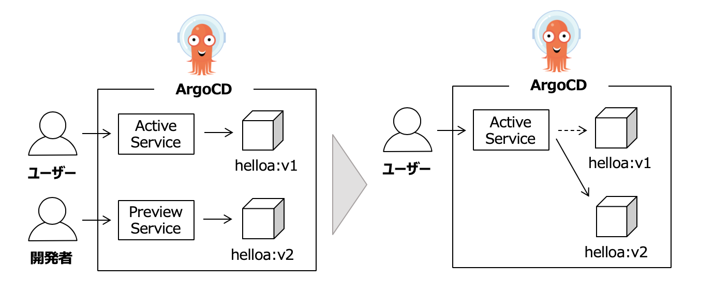
</p>

#### Inputs de aplicação "application.yaml"

O código .yaml abaixo recebe os inputs necessários para realizar o build da aplicação via template. Este arquivo permanece no repositório de cada aplicação, separadamente.



```yaml 
name: Pipeline de Aplicacao
on:
  push:
    branches:
      - dnx

jobs:
  call-workflow:
    permissions:
      contents: read
      pull-requests: write
    uses: desenvolvimento-intuix/template-pipelines/.github/workflows/workflow-app.yaml@master
    with:
      APPLICATION_NAME: auth-api
      MANIFEST: auth-api
      MANIFEST_REPO: desenvolvimento-intuix/Kubernetes-Manifest
      branch: dnx
      ref: dnx
      enable_scan: false
    secrets:
      CI_TOKEN: ${{ secrets.CI_TOKEN }}
      NPM_TOKEN: ${{ secrets.NPM_TOKEN }}     
```

#### Template de aplicação "workflow-app.yaml"

O template abaixo, realiza o build da aplicação de acordo com os inputs informados no arquivo application.yaml. Este arquivo permanece no repositório "template-pipelines". Nele, são informados em "workflow_call" os parâmetros tanto dos inputs quanto dos secrets, separadamente. Também são são informadas as "envs" do ECR e da Região AWS. Em seguida, inicia os jobs da pipeline: build, scan-ci, scan-config, scan-rootfs, scan-fs e update.


```yaml
name: Build Develop Push
on:
  workflow_call:
    inputs:
      APPLICATION_NAME:
        required: true
        type: string
      MANIFEST:
        required: true
        type: string
      MANIFEST_REPO:
        required: true
        type: string
      branch:
        required: true
        type: string
      ref:
        required: true
        type: string
      enable_scan:
        required: true
        type: boolean
    secrets:
      CI_TOKEN:
        required: true
      NPM_TOKEN:
        required: true

env:
  ACCOUNT_ECR: "058264225114"
  REGION: us-east-2

jobs:
  build:
    runs-on: self-hosted
    outputs:
      TAG: ${{ steps.vars.outputs.tag }}
    environment:
      name: develop
    steps:
      - name: Check out the repo
        uses: actions/checkout@v3.6.0
        with:
          ref: ${{ inputs.ref }}
      - name: Set output
        id: vars
        run: echo "::set-output name=tag::$(git rev-parse --short $GITHUB_SHA)"
      - name: Semgrep scan
        run: docker run --rm -v "${PWD}:/src" returntocorp/semgrep semgrep scan --force-color --config auto 
      - name: Docker Build and Push
        run: |
          output=$(aws sts assume-role --role-arn "arn:aws:iam::${{ env.ACCOUNT_ECR }}:role/CIDeployAccess" --role-session-name CIDeployAccessSession)
          export AWS_ACCESS_KEY_ID=$(echo $output | jq -r '.Credentials''.AccessKeyId')
          export AWS_SECRET_ACCESS_KEY=$(echo $output | jq -r '.Credentials''.SecretAccessKey')
          export AWS_SESSION_TOKEN=$(echo $output | jq -r '.Credentials''.SessionToken')
          docker login -u AWS -p $(aws ecr get-login-password --region ${{ env.REGION }} ) ${{ env.ACCOUNT_ECR }}.dkr.ecr.${{ env.REGION }}.amazonaws.com
          docker build --build-arg NPM_TOKEN="${{ secrets.NPM_TOKEN }}" --build-arg ARG_SECRET_KEY_BASE="${{ secrets.SECRET_KEY_BASE }}" -t ${{ env.ACCOUNT_ECR }}.dkr.ecr.${{ env.REGION }}.amazonaws.com/${{ inputs.APPLICATION_NAME }}:${{ steps.vars.outputs.tag }} .
          docker push ${{ env.ACCOUNT_ECR }}.dkr.ecr.${{ env.REGION }}.amazonaws.com/${{ inputs.APPLICATION_NAME }}:${{ steps.vars.outputs.tag }}
  scan-ci: 
    runs-on: self-hosted
    needs: [build]
    environment:
      name: develop
    steps:
      - name: Set output
        if: ${{ inputs.enable_scan }}
        id: vars
        run: echo "::set-output name=tag::$(git rev-parse --short $GITHUB_SHA)"
      - name: Run scanner pipeline
        if: ${{ inputs.enable_scan }}
        uses: aquasecurity/trivy-action@master
        with:
          image-ref: '${{ env.ACCOUNT_ECR }}.dkr.ecr.${{ env.REGION }}.amazonaws.com/${{ inputs.APPLICATION_NAME }}:${{ steps.vars.outputs.tag }}'
          format: 'table'
          ignore-unfixed: true
          vuln-type: 'os,library'
          severity: 'CRITICAL,HIGH' 
  scan-config: 
    runs-on: self-hosted
    needs: [scan-ci]
    steps:
      - name: Set output
        if: ${{ inputs.enable_scan }}
        id: vars
        run: echo "::set-output name=tag::$(git rev-parse --short $GITHUB_SHA)"
      - name: Run vulnerability scanner config
        if: ${{ inputs.enable_scan }}
        uses: aquasecurity/trivy-action@master
        with:
          scan-type: 'config'
          hide-progress: false
          format: 'table'
          ignore-unfixed: true
          severity: 'CRITICAL,HIGH'
  scan-rootfs:
    runs-on: self-hosted
    needs: [scan-config]
    steps:
      - name: Set output
        if: ${{ inputs.enable_scan }}
        run: echo "::set-output name=tag::$(git rev-parse --short $GITHUB_SHA)"
      - name: Run vulnerability scanner local repo
        if: ${{ inputs.enable_scan }}
        uses: aquasecurity/trivy-action@master
        with:
          scan-type: 'rootfs'
          scan-ref: '.'
          ignore-unfixed: true
          format: 'table'
          severity: 'CRITICAL'
  scan-fs:
    runs-on: self-hosted
    needs: [scan-rootfs]
    steps:
      - name: Set output
        if: ${{ inputs.enable_scan }}
        id: vars
        run: echo "::set-output name=tag::$(git rev-parse --short $GITHUB_SHA)"
      - name: Run vulnerability scanner in repo fs
        if: ${{ inputs.enable_scan }}
        uses: aquasecurity/trivy-action@master
        with:
          scan-type: 'fs'
          ignore-unfixed: true
          format: 'table'
          severity: 'CRITICAL'
  update:
    runs-on: self-hosted
    needs: build
    steps:
      - name: Check out Argo Manifests
        uses: actions/checkout@v3.6.0
        with:
          token: ${{ secrets.CI_TOKEN }}
          repository: ${{ inputs.MANIFEST_REPO }}
          ref: ${{ inputs.branch }}

      - name: Update image deployment DEV
        run: |
          export IMAGE_TAG=${{ needs.build.outputs.TAG }} 
          yq e '.images[0].newTag = env(IMAGE_TAG)' -i ${{ inputs.MANIFEST }}/dev/kustomization.yaml

      - name: Commit & Push Argo
        uses: actions-js/push@v1.4
        with:
          github_token: ${{ secrets.CI_TOKEN }}
          repository: ${{ inputs.MANIFEST_REPO }}
          branch: ${{ inputs.branch }}
```


#### Visualização da pipeline em funcionamento

Após a realização do push no repositório da aplicação, a pipeline realiza os stages em conformidade com o que foi definido nos arquivos "application.yaml" e "workflow-app.yaml".

<p align="center">
  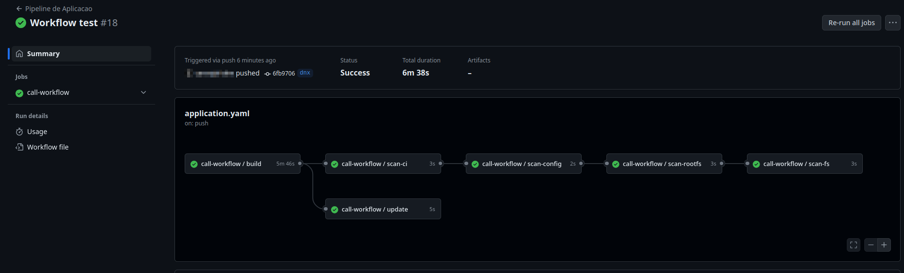
</p>

Ao clicar nos stages, é possível obter maiores detalhes:

##### call-workflow / build
<p align="center">
  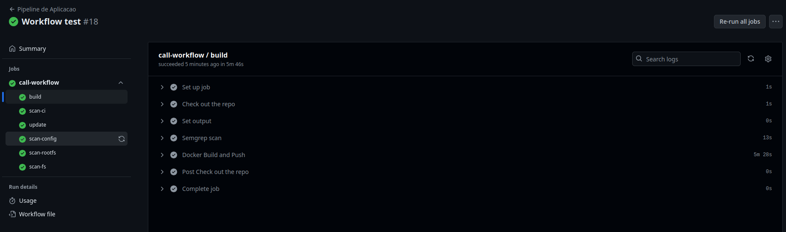
</p>

##### call-workflow / scan-ci

<p align="center">
  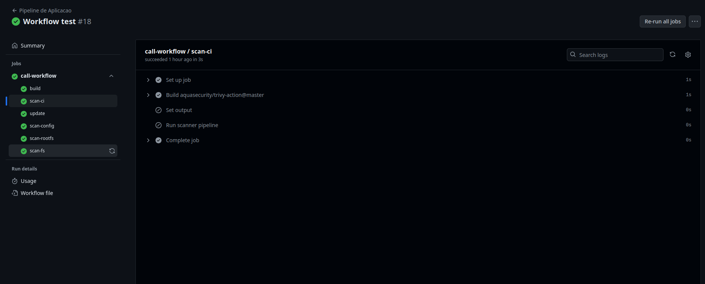
</p>

##### call-workflow / update

<p align="center">
  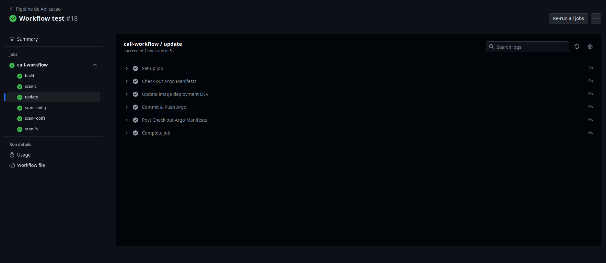
</p>

##### call-workflow / scan-config
<p align="center">
  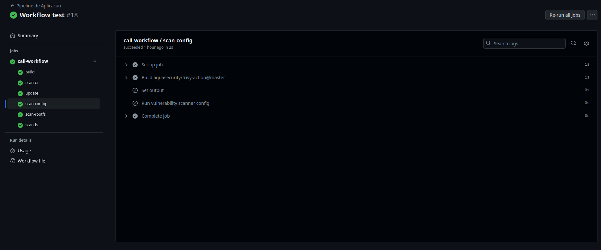
</p>

##### call-workflow / scan-rootfs
<p align="center">
  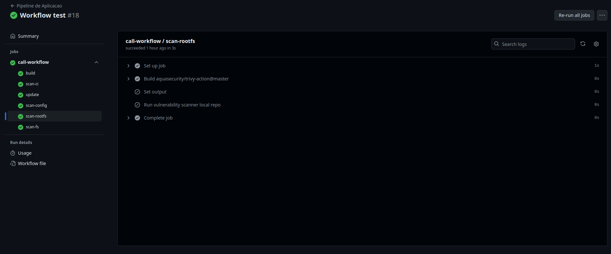
</p>

##### call-workflow / scan-fs
<p align="center">
  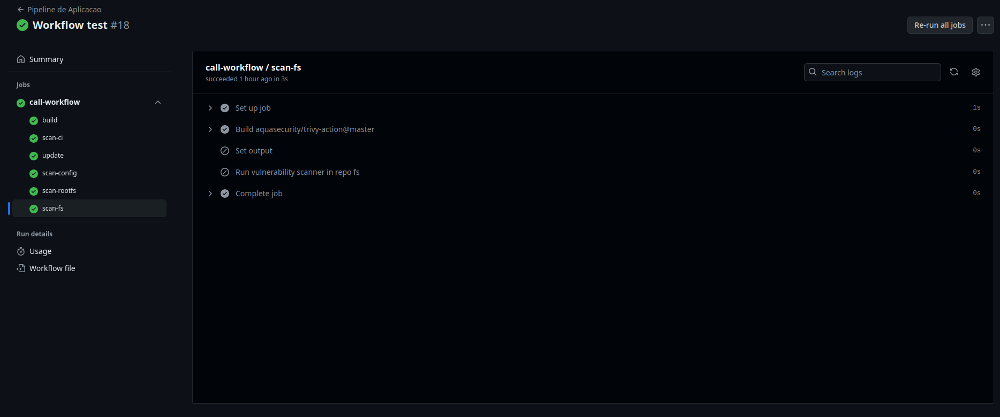
</p>

# Kubernetes Manifest

Antes de realizarmos o deployment da aplicação via ArgoCD, é necessário realizar as configurações dos arquivos do repositório Kubernetes Manifest para cada aplicação. A estrutura dos arquivos se dá em um diretório principal da aplicação "nome-da-app", e dois sub-diretórios: "base" e "dev", com os seguintes arquivos:

<p align="center">
  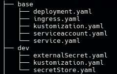
</p>

Para alterarmos os parâmetros corretamente, realizamos o patch dos arquivos no arquivo "kustomization.yaml" do diretório "dev".

#### Diretório "base"

##### kustomization.yaml

<p align="left">
  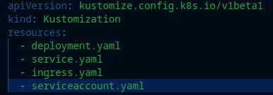
</p>

#### Diretório "dev"

##### kustomization.yaml

<p align="left">
  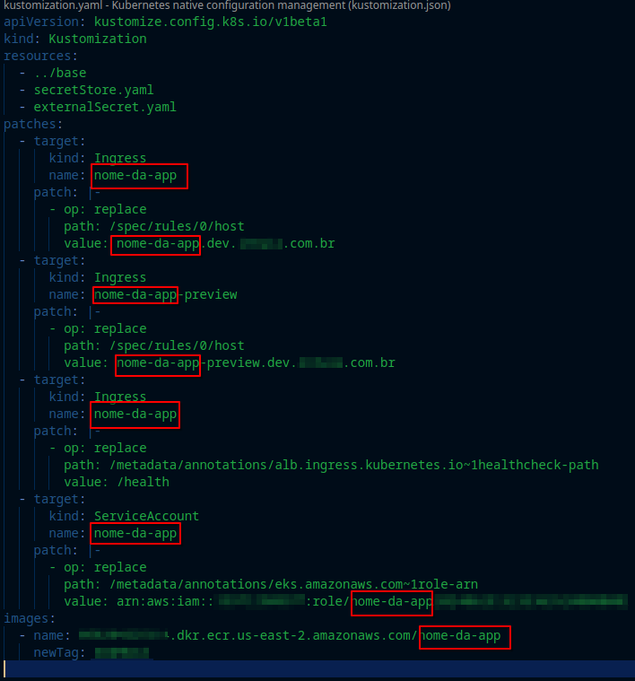
</p>

No arquivo "kustomization.yaml" do diretório "dev", em "patches", definimos as substituições conforme o modelo acima, informando a operação "replace", e o path específico do parâmetro que será substituído, com seu novo parâmetro em "value".

Exemplo para alteração do parâmetro "port" do arquivo ingress.yaml:

<p align="left">
  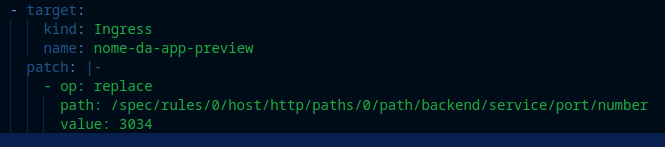
</p>

##### externalSecret.yaml

<p align="left">
  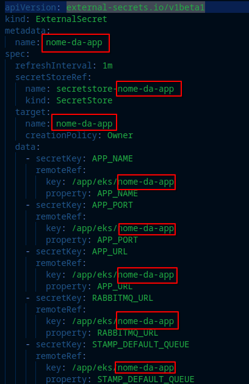
</p>

Em relação ao arquivo externalSecrets, é necessário informar manualmente as secretKeys de acordo com as secrets que foram criadas no Secrets Manager via console da AWS. Basta seguir o modelo. Importante recordar que os values estarão guardados de forma segura no Secrets Manager, não havendo a necessidade de informá-los neste arquivo.

##### secretStore.yaml

<p align="left">
  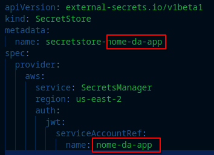
</p>

No arquivo secretStore.yaml, também devemos informar manualmente o nome da aplicação como parâmetro.

# Secrets Manager

Conforme a parametrização dos secrets no repositório Kubernetes-Manifest, devemos informar os valores dos secrets no Secrets Manager via console da AWS. Para isso, basta seguir o passo a passo:

1. Acessar "Secrets Manager" > Secret criado para a aplicação

2. Clicar em "Retrieve secret value"

<p align="left">
  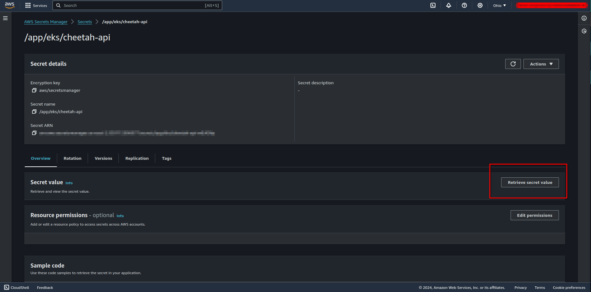
</p>

3. Clicar em "Edit"

<p align="left">
  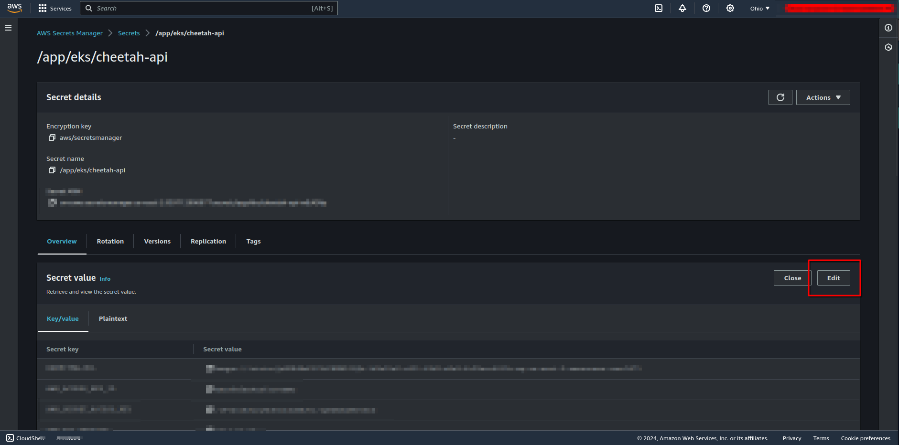
</p>

4. Inserir as keys e os values de cada secret, respectivamente.

<p align="left">
  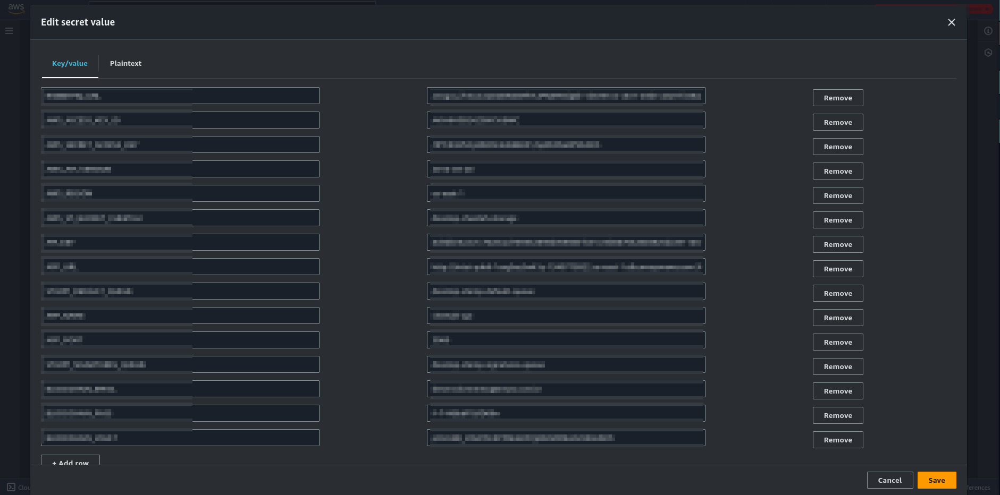
</p>

---

Uma vez que todos os arquivos estão em conformidade com as configurações específicas da aplicação, é possível prosseguir para a sincronização no ArgoCD.

---

# ArgoCD: Sincronização de aplicações 

Após o build da aplicação via pipeline e da configuração dos arquivos no repositório Kubernetes Manifest, é utilizado o ArgoCD para realizar o deployment da aplicação no EKS Cluster. Para isso, é necessário criar a aplicação no ArgoCD. Além disso, como dito anteriormente, há a possibilidade de configurar o ArgoCD para sincronizações automáticas, ou manuais. Neste caso, vamos demonstrar passo a passo a criação e a sincronização de uma aplicação de forma manual.

Criaremos uma aplicação de exemplo, com o nome "cheetah-api":

#### Criação da aplicação

1. Clicar em " + New App"

<p align="center">
  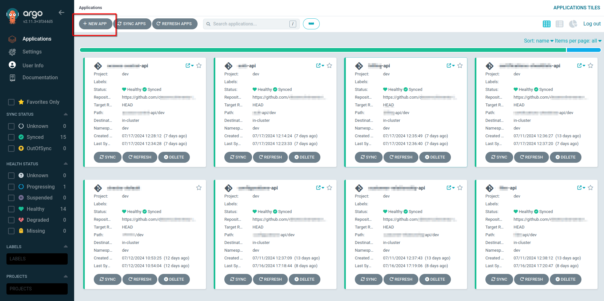
</p>

2. Definir os campos: "Application Name", "Project Name" e "SYNC POLICY" conforme abaixo:

<p align="center">
  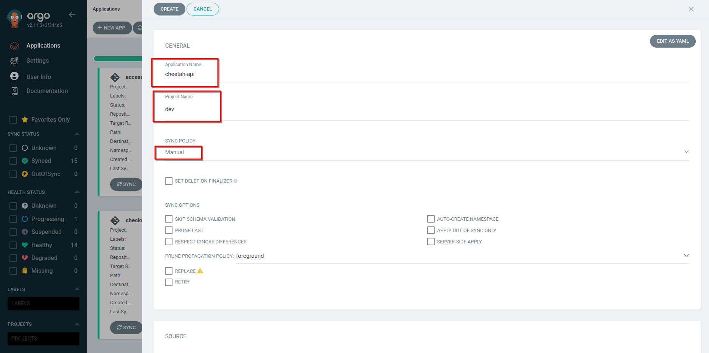
</p>

3. Definir a URL do repositório Kubernetes-Manifest, o path onde está o diretório "dev" da aplicação, o endereço do cluster local, e o namespace "dev".

<p align="center">
  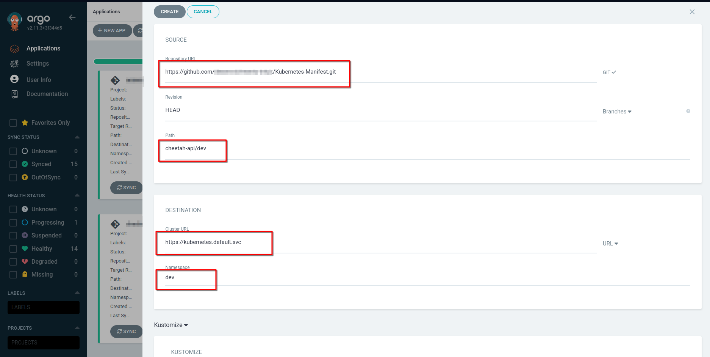
</p>

4. É possível observar que a imagem da aplicação será automaticamente preenchida, caso todos os outros passos anteriores (inclusive de pipeline) tenham sido efetuados corretamente:

<p align="center">
  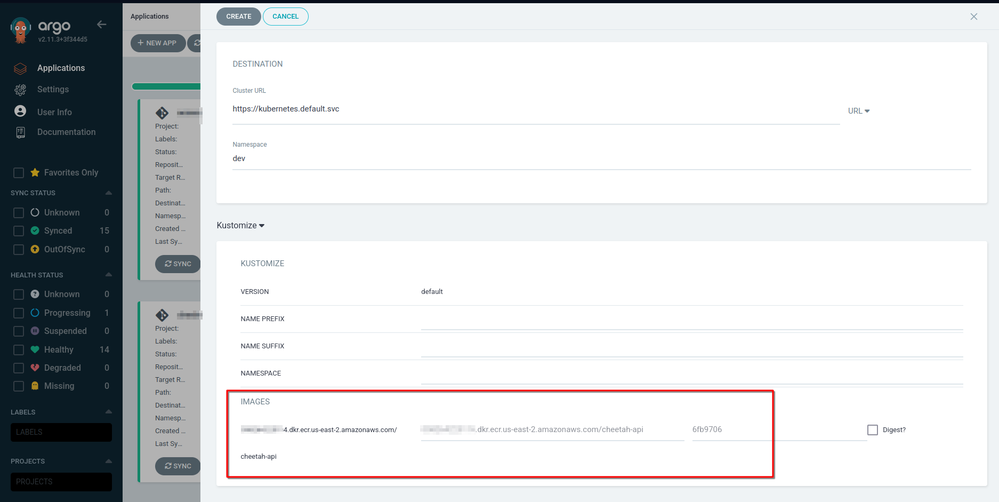
</p>

#### Sincronização da aplicação

Após criarmos a aplicação, devemos sincronizá-la da forma correta. A princípio, o status da aplicação constará como "Missing". Para sincronizá-la, basta clicar na aplicação e seguir os passos:

<p align="center">
  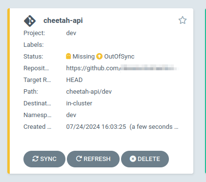
</p>

1. Clicar nos menu de três pontos ao lado de cada item, em seguida em "Sync". A ordem correta para sincronização, conforme a imagem, é a seguinte:

- ServiceAccount
- SecretStore
- ExternalSecret
- Services (active e preview)
- Ingresses (active e preview)
- Deployment

<p align="center">
  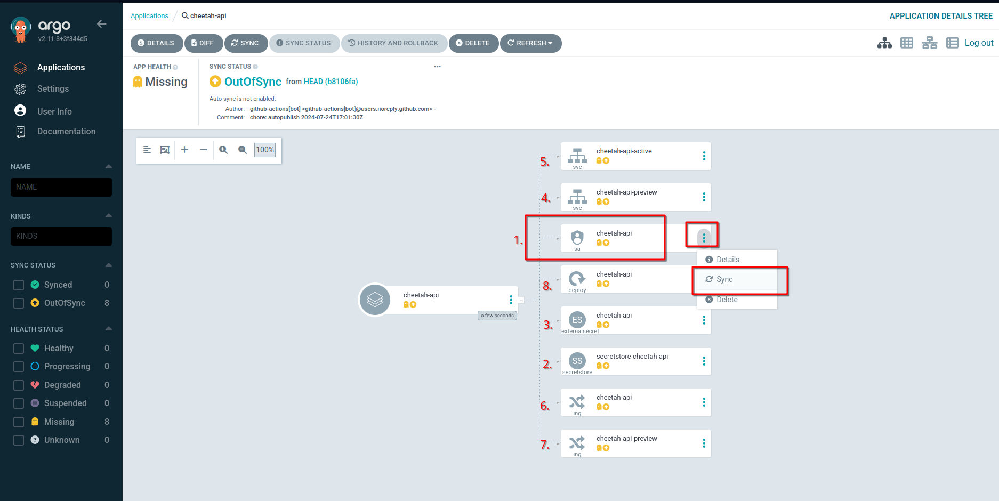
</p>

Após a sincronização de cada um dos itens, a visualização será a seguinte:

<p align="center">
  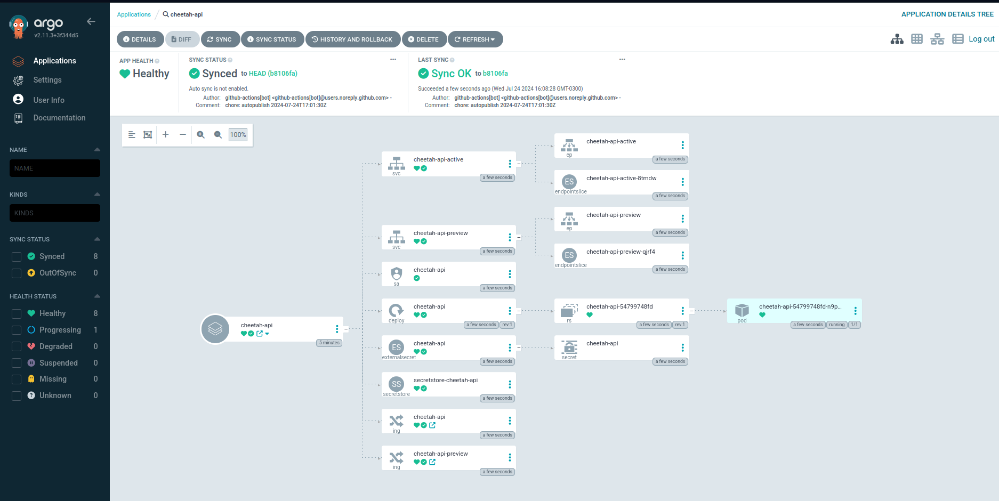
</p>

Para conferir se o Ingress está configurado corretamente, é possível clicar nas setas:

<p align="center">
  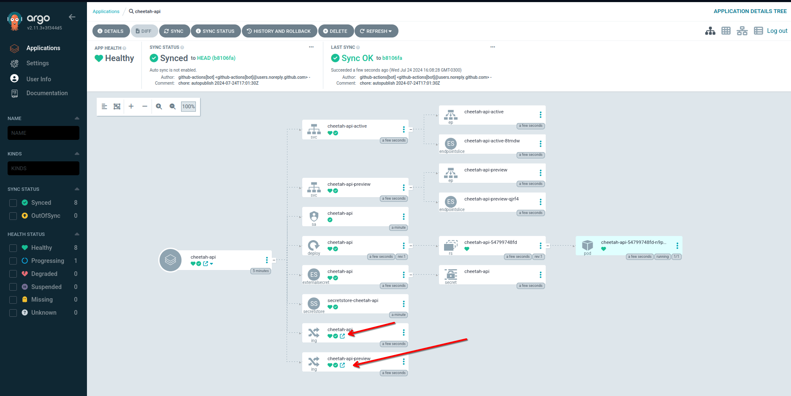
</p>

Após clicar, podemos conferir o healthcheck da aplicação:

<p align="center">
  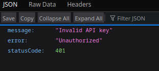
</p>

Pronto! Agora, podemos conferir o deployment da aplicação no cluster EKS:

<p align="center">
  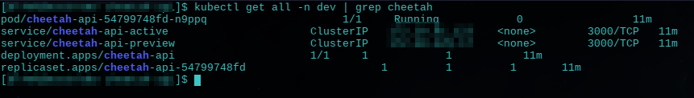
</p>






# Monitoramento ECS




O monitoramento do ambiente ECS utiliza as métricas e logs disponível no Cloudwatch, onde a visualização é através do Grafana:

- **Nonprod:** {{ GRAFANA_URL_NONPROD }}
- **Prod:** {{ GRAFANA_URL_PROD }}

Alguns Dashboard são fornecidos para acompanhar o ambiente, que são:

- **ECS V2**: métricas referentes as aplicações ecs(memoria, cpu, network);
- **AWS ELB**: métricas relacionadas aos request para a aplicação;
- **CloudWatch Logs**: logs das aplicações e cloudtrail, guardduty e securityhub;
- **Amazon RDS**: métricas relacionadas aos bancos de dados;
- **Amazon EC2**: métricas relacioandas as instancias ec2(cpu, memori, disk)

<p align="center">
  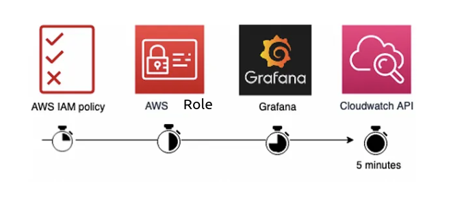
</p>



O monitoramento do ambiente ECS utiliza as métricas coletadas pelo OpenTelemetry Collector, os quais o envia para o servidor EC2 com os serviços de Loki(logs) e Tempo(traces) + Cloudwatch para compor a stack completa:

<p align="center">
  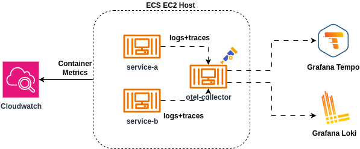
</p>


- **Logs**
- **Traces**(Se devidamente iniciado com a lib de auto instrumentação na aplicação)

As metrics são extraidas do cloudwatch, sendo as principais:

- **Container Insights**(metricas por container)
- **ALB metricas**


A visualização d as informações dos ambientes podem ser visualizadas nos Grafana de cada ambiente:

- **Nonprod:** {{ GRAFANA_URL_NONPROD }}
- **Prod:** {{ GRAFANA_URL_PROD }}




# Alertas ECS
Alguns alertas básicos são configurados no grafana, o endpoint de notificação fica a cargo de decisão do cliente, os alertas são:

- **Uso de CPU > 90%**
- **Uso de Memoria > 90%**
- **Aplicações Pendentes por mais de 5 min**

<p align="center">
  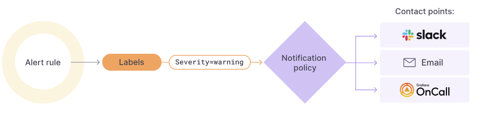
</p>



# Monitoramento EKS


O monitoramento do ambiente EKS utiliza as métricas e logs disponível no Prometheus e Grafana Loki prioritamente, e também usa o Cloudwatch para visualizar as demais métricas do ambiente da AWS. Varios dashboards são implementados por padrão, que fazem a parte da stack kube-prometheus-stack, mais detalhes podem ser conferidos no link: https://github.com/prometheus-community/helm-charts/tree/main/charts/kube-prometheus-stack.

**Nonprod**: {{ GRAFANA_URL_NONPROD }}
**Prod**: {{ GRAFANA_URL_PROD }}


<p align="center">
  
</p>


Para os logs do ambiente das aplicações, uma copia extra é realizada para o S3, para que possa ser acessada caso o kubernetes fique indisponível.

#### Visualização dos Dashboards do Grafana

Ao acessar o Grafana, há diversos Dashboards pré-configurados pelo AlertManager em relação ao consumo de recursos computacionais do cluster Kubernetes.

<p align="center">
  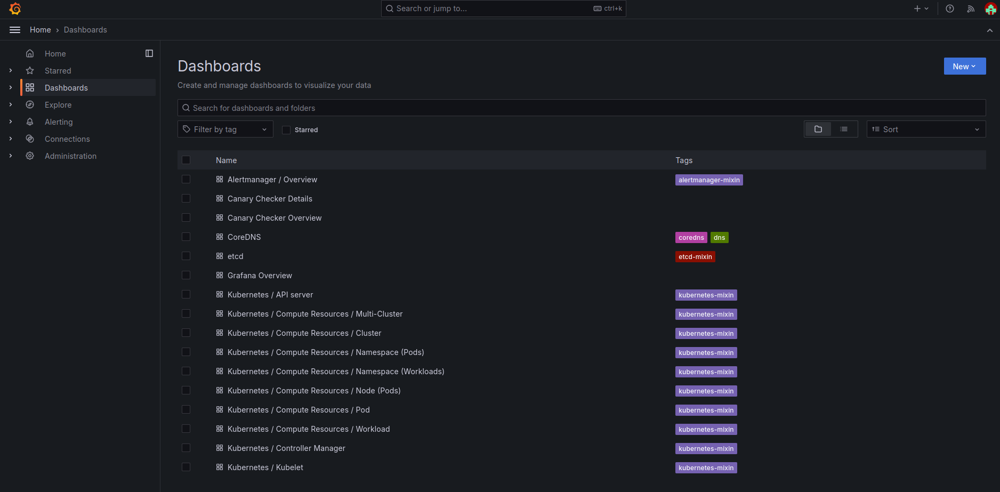
</p>

Ao clicar em um dashboard específico, é possível observar mais detalhes:

##### Kubernetes / Compute Resources / Cluster

<p align="center">
  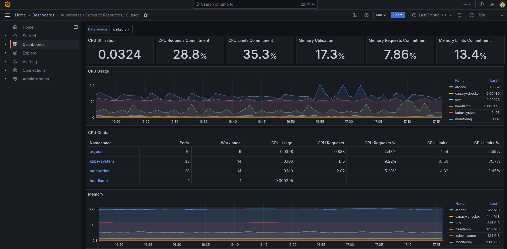
</p>

##### Kubernetes / Compute Resources / Nodes (pods)

<p align="center">
  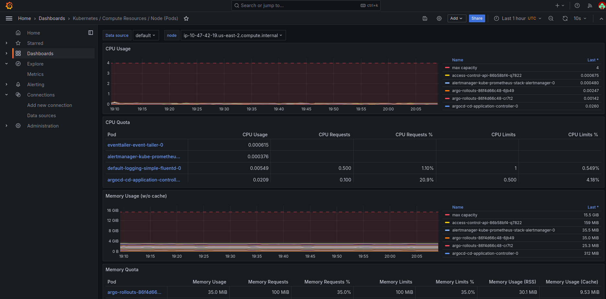
</p>

##### Kubernetes / Compute Resources / Pods

<p align="center">
  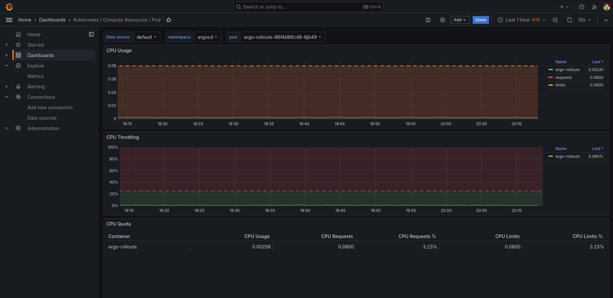
</p>

##### Kubernetes / Canary Checker Details

<p align="center">
  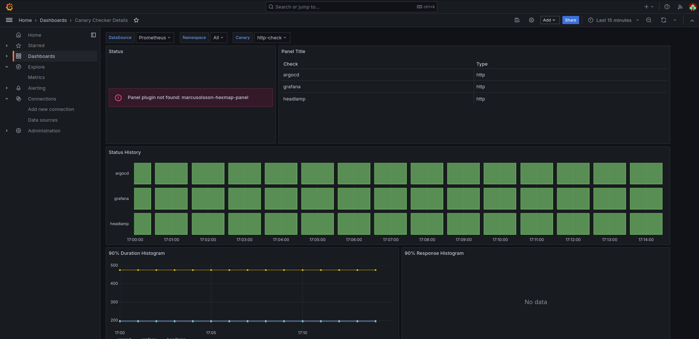
</p>


# Alertas EKS

A stack kube-prometheus-stack já implementa varios alertas através do alertmanager, sendo necessario apenas habilitar o endpoint de notifiação.

<p align="center">
  
</p>




# Informações dos recursos provisionados



### Apps ECS com Load Balancer 

|Nome | Tipo de ALB| Hostnames   | Launch Type |
 |:-------:| :-------:|:-------:|:-------:|
 | {{ item.name }} | {{ item.alb }}  | {{ item.hostnames }}   |{{ item.launchType }}  |





### Apps ECS sem Load Balancer(Worker) 

|Nome | Launch Type |
 |:-------:| :-------:|
 | {{ item.name }} |{{ item.launchType }}  |






### Apps ECS com Scheduler 

|Nome | Launch Type | Cron |
 |:-------:| :-------:| :-------:|
 | {{ item.name }} |{{ item.launchType }}  | {{ item.scheduleExpression }}






### Instancia(s) EC2 

| Nome  | Tipo de Instancia   | Tipo de Subnet| AMI | Tamanho do volume |
|:---------: |:-------:| :-------:|:-------:|:-------:|
 | {{ ec2_item.name }}  | {{ ec2_item.instanceType }}   |{{ ec2_item.subnetType }}  |{{ ec2_item.ami }}    | {{ ec2_item.volumeSize }} GB|






### Instancia(s) Beanstalk 

| Environment  | Stack name  | Storage | Tipos de instancias   |
|:---------: |:-------:| :-------:|:-------:|
 |{{ beanstalk_item.environment }}| {{ beanstalk_item.solutionStackName }}  | {{ beanstalk_item.volumeSize }} GB | {{ instance_type }},  |





### Instancia(s) DOCDB 

|Nome | Instance Name | Tipo de Instancia   | Engine |
 |:-------:| :-------:|:-------:|:-------:|
 | {{ docdb_item.name }} | {{ docdb_item.instanceName }}  | {{ docdb_item.instanceClass }}   |{{ docdb_item.engine }}  |






### Load Balancer(s) 

| Nome  | Tipo de LB  | Tipo de Subnet   |
|:---------: |:-------:| :-------:|
 |{{ lb_item.name }}| {{ lb_item.loadBalancerType }}  | {{ lb_item.subnetType }} |






### Redis 

| Nome  | Failover Habilitado  | Multi AZ   | Engine Version| Tipo de Instancia |
|:---------: |:-------:| :-------:|:-------:|:-------:|
 | {{ redis_item.name }} | {{ redis_item.automaticFailoverEnabled }}  | {{ redis_item.multiAzEnabled }}   |{{ redis_item.engineVersion }}  | {{ redis_item.nodeType }} |






### RDS 

#### Instancia(s)
| Nome | Classe da Instancia  | Storage  | Engine   | Engine Version|
|:---------: |:-------:| :-------:|:-------:|:-------:|
 | {{ rds_item.name }}| {{ rds_item.instanceClass }} | {{ rds_item.allocatedStorage }} GB | {{ rds_item.engine }}   |{{ rds_item.engineVersion }}  |





#### Cluster(s) RDS 

| Nome | Classe  | Engine | Engine Version   |
|:---------: |:-------:| :-------:|:-------:|
 | {{ rds_item.name }} |{{ rds_item.instanceClass }}| {{ rds_item.engine }}  | {{ rds_item.engineVersion }} |





### Buckets S3 

| Nome  | ACL  |
|:---------: |:-------:|
 |{{ s3_item.name }}| {{ s3_item.acl }}  |






### SNS 

| Nome  | Subscriptions |
|:---------:|:---------:|
 |{{ sns_item.name }} | {{ sns_item.subscriptions }} |






### SQS 

| Nome  | FIFO  |
|:---------: |:-------:|
 |{{ sqs_item.name }}| {{ sqs_item.fifoQueue }}  |






### SSM 

| Nome  |
|:---------: |
 |{{ item.name }}|






### Secret Manager 

| Nome  |
|:---------: |
 |{{ item.name }}|





### IAM Roles 

| Nome  |
|:---------: |
 |{{ item.name }}|





# Diagrama da infraestrutura



<p align="center">
  
</p>




<p align="center">
  
</p>




<p align="center">
  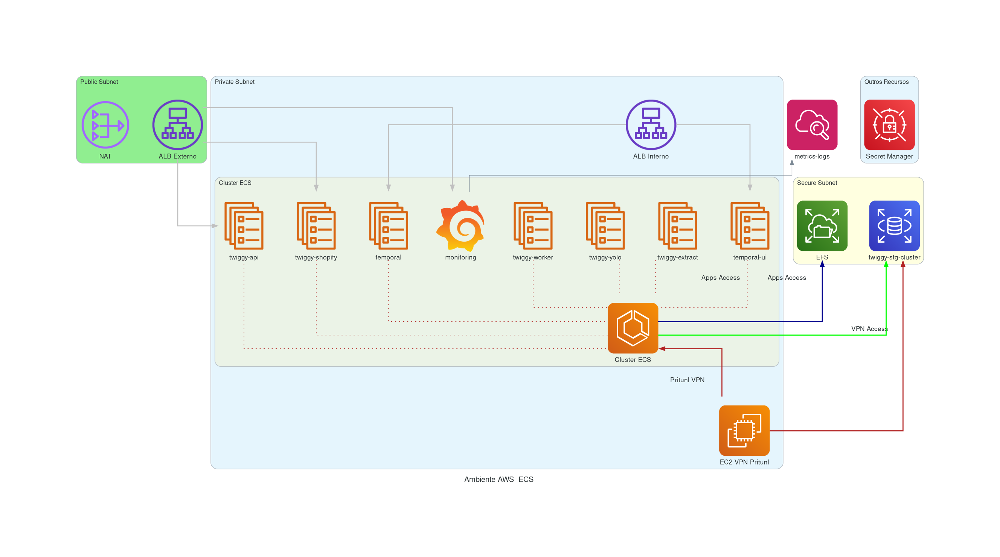
</p>




# ArgoCD ECS Manifests

Existem 3 manfiestos configurado para deploy com ECS:
- **ServiceEC2Worker**: Cria um service no cluster ECS do typo workere, sem acesso via ALB;

<p align="center">
  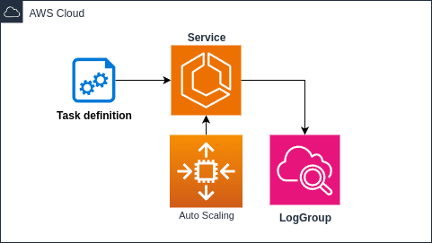
</p>

Yaml de Exemplo:

```yaml
apiVersion: kro.run/v1alpha1
kind: ServiceEC2Worker
metadata:
  name: service-ecs-ec2-nginx-worker # Nome do servico
  namespace: nonprod #Divisao logica de onde ficaram os recursos nonprod e prod
spec:
  name: nginx-worker #Nome do servico
  hash: "" #Sera atualizado pelo hash da tag da imagem docker
  region: sa-east-1
  vpcName: vpc-nonprod #Nome da VPC
  networkMode: bridge
  taskRoleArn: arn:aws:iam::000000000000:role/ecs-task-dev-nonprod-sa-east-1 #Permissoes da task
  executionRoleArn: arn:aws:iam::000000000000:role/ecs-task-dev-nonprod-sa-east-1
  cluster: ecs-dev-nonprod-sa-east-1 #Nome do cluster onde sera feito o deploy
  capacityProvider: dev-nonprod-sa-east-1-capacity-provider #Nome do capacity provider que contem as configuracoes de instancias
  image: nginx:latest #Imagem do container
  account: "0000000000000" #Conta de destino
  containerPort: 80 #Porta do Container
  logGroupRetention: 7 #Retencao dos logs
  cpu: 200 #CPU Alocado
  memory: 512 #Memoria Alocada
  providerName: aws-provider-nonprod #Provider com as credencias de acesso ao ambiente
  autoscale: 
    enabled: false  #Habilitar o desabilitar o autoscale dos container
    minCapacity: 1 #Numero minimo de container
    maxCapacity: 3 #Numero maximo de container
  autoscaleCPU:
    enabled: false #Habiltar autoscale por CPU
    cpuUsage: 70 #Porcentagem de CPU utilizada que ira aicionar
  autoscaleMemory:
    enabled: false #Habiltar autoscale por Memoria
    memoryUsage: 70 #Porcentagem de memoria utilizada que ira aicionar
  launchType: EC2 
  desiredCount: 1 #Numero de replicas desejada do container
  scEnabled: false #Se habilita o service connector, que permiti conexao entre os containers pelo nome do servico
  scNamespaceARN: arn:aws:servicediscovery:sa-east-1:000111222333:namespace/ns-xxxxxxxxxxxx #ARN do namespace para o service connector 
  environment: |- #Configuracao das variaveis de ambiente
     [
                {
                    "name": "variable",
                    "value": "value"
                }
     ]
  secrets: |- #Configuracao de acesso a secret amanger
     []        

```

- **ServiceEC2**: Cria um service no cluster ECS com acesso via ALB;

<p align="center">
  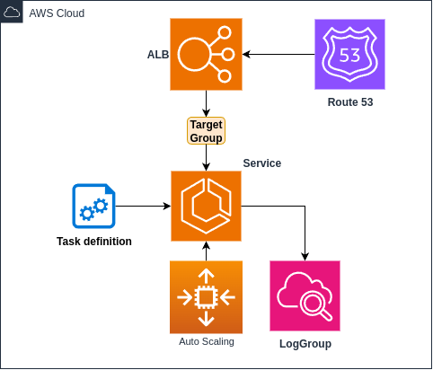
</p>

Yaml de exemplo:

```yaml
apiVersion: kro.run/v1alpha1
kind: ServiceEC2
metadata:
  name: service-ecs-ec2-nginx-lb
  namespace: nonprod
spec:
  name: nginx-lb
  hash: "teste"
  region: sa-east-1
  vpcName: vpc-nonprod
  taskRoleArn: arn:aws:iam::0000000000000:role/ecs-task-dev-nonprod-sa-east-1
  executionRoleArn: arn:aws:iam::000000000000:role/ecs-task-dev-nonprod-sa-east-1
  cluster: ecs-dev-nonprod-sa-east-1
  capacityProvider: dev-nonprod-sa-east-1-capacity-provider
  image: nginx:1.28.0-alpine
  account: "000000000000"
  containerPort: 80
  cpu: 200
  memory: 512
  providerName: aws-provider-nonprod
  zoneId: Z001000000000000 #Zona id do Route53
  lbDNS: internal-ecsInternal-000000000000.sa-east-1.elb.amazonaws.com #DNS do load balancer a ser utilizado, podendo ser interno ou externo
  listenerBlName: list-bl-dev-apps-int #Listerner do load balancer(porta 443)
  hostname: nginx-lb.developer.aws.com #Hostname que a aplicacao ira responder
  pritunlZero: true #Habilitar pritunl-zero como proxy de acesso
  pritunlZeroDNS: pritunl-zero-000000000000.elb.sa-east-1.amazonaws.com #Load balacner do pritunl-zero
  autoscale:
    enabled: true
    minCapacity: 1
    maxCapacity: 3
  autoscaleCPU:
    enabled: true
    cpuUsage: 90
  autoscaleMemory:
    enabled: true
    memoryUsage: 90
  environment: |-
     []
  secrets: |-
     []      

```

- **ServiceEC2BG**: Cria um service no cluster ECS com acesso via ALB com a estrategia de deploy Blue Green;

<p align="center">
  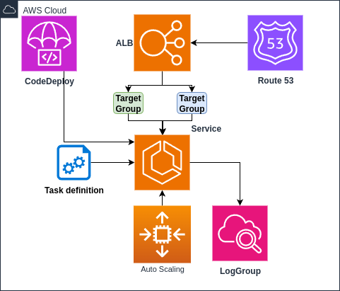
</p>

Yaml de exemplo:


```yaml
apiVersion: kro.run/v1alpha1
kind: ServiceEC2BG
metadata:
  name: service-ecs-ec2-proxy-bg
  namespace: nonprod
spec:
  name: proxy-bg
  hash: "12345"
  region: sa-east-1
  vpcName: vpc-nonprod
  taskRoleArn: arn:aws:iam::000000000000:role/ecs-task-dev-nonprod-sa-east-1
  executionRoleArn: arn:aws:iam::000000000000:role/ecs-task-dev-nonprod-sa-east-1
  cluster: ecs-dev-nonprod-sa-east-1
  capacityProvider: dev-nonprod-sa-east-1-capacity-provider
  image: nginx:1.26.0-alpine
  account: "000111222333"
  containerPort: 80
  cpu: 200
  memory: 512
  providerName: aws-provider-nonprod
  zoneId: Z001000000000000
  lbDNS: ecs-000000000000.sa-east-1.elb.amazonaws.com
  listenerBlName: list-bl-dev-apps #Listerner do load balancer(porta 443)
  listenerGrName: list-gr-dev-apps #Listerner do load balancer(porta 8443)
  listenerGrArn: arn:aws:elasticloadbalancing:sa-east-1:000000000000:listener/app/ecs-89509c7/xxxxxxxxxxxxx # ARN do listener green
  deploymentGroupRoleArn: arn:aws:iam::000000000000:role/codedeploy-service-dev-nonprod-sa-east-1 #Role do codedeplo, fixo por ambiente
  bucketS3: argocd-ecs-nonprod-000000000000 #Bucker com config do deploy blug green, fixo por ambiente
  hostname: proxy-bg.developer.aws.com
  autoscale:
    enabled: false
    minCapacity: 1
    maxCapacity: 3
  autoscaleCPU:
    enabled: false
    cpuUsage: 90
  autoscaleMemory:
    enabled: false
    memoryUsage: 90
  environment: |-
     []
  secrets: |-
     []          

```

## Estrutura de pastas e arquivos repositorio de manifest

```
── ecr
│   ├── app.yaml
│   ├── kustomization.yaml
│   └── nginx.yaml
├── nonprod
│   ├── apps
│   │   └── Voa-Health
│   │       ├── voa-realtime
│   │       │   ├── app.yaml
│   │       │   └── kustomization.yaml
│   │       └── voa-transcriber
│   │           ├── app.yaml
│   │           └── kustomization.yaml
│   ├── imported_resources
│   │   ├── import.yaml
│   │   └── kustomization.yaml
│   └── roles
│       ├── ecs.yaml
│       └── kustomization.yaml
├── prod
│   ├── apps
│   └── imported_resources
└── template
    ├── rgd-ecs-ec2-blue-green.yaml
    ├── rgd-ecs-ec2-load-balancer.yaml
    └── rgd-ecs-ec2-worker.yaml
```

- **Diretorio ecr**: contem as definições de criação do repositorio ecr e policy de acesso para as contas de nonprod e prod:
  - **Arquivo app.yaml**:

```yaml
apiVersion: ecr.aws.upbound.io/v1beta1
kind: Repository
metadata:
  annotations:
    crossplane.io/external-name: repo-name
  labels:
    cros.upbound.io/repoecr: repo-name #Nome do repositorio
  name: repo-name
spec:
  forProvider:
    region: sa-east-1
  providerConfigRef:
    name: aws-provider-shared
--- # <--------------------------------- separador de arquivos
apiVersion: ecr.aws.upbound.io/v1beta1
kind: RepositoryPolicy
metadata:
  name: repo-name 
spec:
  forProvider:
    region: sa-east-1
    policy: |
      {
        "Statement": [
          {
            "Sid": "AllowPull",
            "Effect": "Allow",
            "Principal": {
              "AWS": [
                "arn:aws:iam::000000000000:root", //Contas  que podem de realizar pull das imagens
                "arn:aws:iam::111111111111:root",
                "arn:aws:iam::222222222222:root"
              ]
            },
            "Action": [
              "ecr:BatchCheckLayerAvailability",
              "ecr:BatchGetImage",
              "ecr:DescribeImageScanFindings",
              "ecr:GetDownloadUrlForLayer"
            ]
          },
          {
            "Action": [
              "ecr:BatchCheckLayerAvailability",
              "ecr:BatchGetImage",
              "ecr:CompleteLayerUpload",
              "ecr:GetDownloadUrlForLayer",
              "ecr:InitiateLayerUpload",
              "ecr:PutImage",
              "ecr:UploadLayerPart"
            ],
            "Principal": {
              "AWS": [
                "arn:aws:iam::000000000000000:root" //Conta shared onde o repo foi criado
              ]
            },
            "Effect": "Allow",
            "Sid": "AllowWriteMgmt"
          },
          {
            "Condition": {
              "StringLike": {
                "aws:sourceArn": [
                  "arn:aws:lambda:sa-east-1:000000000000:function:*",
                  "arn:aws:lambda:sa-east-1:111111111111:function:*",
                  "arn:aws:lambda:sa-east-1:222222222222:function:*"
                ]
              }
            },
            "Action": [
              "ecr:BatchGetImage",
              "ecr:GetDownloadUrlForLayer"
            ],
            "Principal": {
              "Service": [
                "lambda.amazonaws.com"
              ]
            },
            "Effect": "Allow",
            "Sid": "LambdaECRImageCrossAccountRetrievalPolicy"
          }
        ],
        "Version": "2012-10-17"
      }
    repositorySelector:
      matchLabels:
        cros.upbound.io/repoecr: voa-transcriber
  providerConfigRef:
    name: aws-provider-shared
```

  - **Arquivo kustomization.yaml**:
    O arquivo ira referenciar os recursos a serem criados

```yaml
apiVersion: kustomize.config.k8s.io/v1beta1
kind: Kustomization
resources:
  - app.yaml
```

- **Diretorios nonprod e prod**: contem  as definições das aplicações a serem criadas no cluster ecs por ambiente, seguinda a estrutura **{Ambiente}/app/{Org}/{nome_arquivo}.yaml**

  - **Arquivo de exemplo de app**:

```yaml

apiVersion: kro.run/v1alpha1
kind: ServiceEC2Worker
metadata:
  name: service-ecs-ec2-nginx-worker
  namespace: nonprod
spec:
  name: nginx-worker
  hash: "teste"
  region: sa-east-1
  vpcName: vpc-nonprod
  networkMode: bridge
  taskRoleArn: arn:aws:iam::000000000000:role/ecs-task-dev-nonprod-sa-east-1
  executionRoleArn: arn:aws:iam::000000000000:role/ecs-task-dev-nonprod-sa-east-1
  cluster: ecs-dev-nonprod-sa-east-1
  capacityProvider: dev-nonprod-sa-east-1-capacity-provider
  image: nginx:latest
  account: "000000000000"
  containerPort: 80
  logGroupRetention: 7
  cpu: 200
  memory: 512
  providerName: aws-provider-nonprod
  autoscale:
    enabled: false
    minCapacity: 1
    maxCapacity: 3
  autoscaleCPU:
    enabled: false
    cpuUsage: 70
  autoscaleMemory:
    enabled: false
    memoryUsage: 70
  launchType: EC2
  desiredCount: 1
  scEnabled: false
  scNamespaceARN: arn:aws:servicediscovery:sa-east-1:000000000000:namespace/ns-xxxxxxxxxx  
  environment: |-
     [
                {
                    "name": "variable",
                    "value": "value"
                }
     ]
  secrets: |-
     []        

```

- **Diretorio roles**: Contem a definição de Roles e Policies a serem criadas, um role já é provisionada com permissões necessarías. Podera ser implantado via ArgoCD se necessario:


```yaml
....
```
- **Diretorio imported_resourcesoles**: são recursos importados criados anteriormente por Iac, basicamente são estaticos, raramente mudam após a criação:

```yaml

kind: LBListener
metadata:
  annotations:
    crossplane.io/external-name:  arn:aws:elasticloadbalancing:sa-east-1:000111222333:listener/app/ecs-xxxx/xxxxxxxxxxxxxxxxx/xxxxxxxxxxxxxxx # 8443
  labels:
    cros.upbound.io/ecs-lgr-name: list-gr-dev-apps
  name: list-gr-dev-apps
spec:
  forProvider:
    region: sa-east-1
  managementPolicies: ["Observe"]
  providerConfigRef:
    name: aws-provider-nonprod
---
apiVersion: elbv2.aws.upbound.io/v1beta2
kind: LBListener
metadata:
  annotations:
    crossplane.io/external-name:  arn:aws:elasticloadbalancing:sa-east-1:000111222333:listener/app/ecs-xxxx/xxxxxxxxxxx/xxxxxxxxxxxxx # 443
  labels:
    cros.upbound.io/ecs-lgr-name: list-bl-dev-apps
  name: list-bl-dev-apps
spec:
  forProvider:
    region: sa-east-1
  managementPolicies: ["Observe"]
  providerConfigRef:
    name: aws-provider-nonprod
---
apiVersion: ec2.aws.upbound.io/v1beta1
kind: VPC
metadata:
  name: vpc-nonprod
  annotations:
    crossplane.io/external-name: vpc-00000000000000 # ID
  labels:
    cros.upbound.io/vpc-name: vpc-nonprod
spec:
  forProvider:
    region: sa-east-1
  managementPolicies: ["Observe"]
  providerConfigRef:
    name: aws-provider-nonprod
---
apiVersion: elbv2.aws.upbound.io/v1beta2
kind: LBListener
metadata:
  annotations:
    crossplane.io/external-name:  arn:aws:elasticloadbalancing:sa-east-1:000111222333:listener/app/ecsInternal-xxxxxxx/ xxxxxxxxxxxxxxx/xxxxxxxxxxxxxx # 8443
  labels:
    cros.upbound.io/ecs-lgr-name: list-gr-dev-apps-int
  name: list-gr-dev-apps-int
spec:
  forProvider:
    region: sa-east-1
  managementPolicies: ["Observe"]
  providerConfigRef:
    name: aws-provider-nonprod
---
apiVersion: elbv2.aws.upbound.io/v1beta2
kind: LBListener
metadata:
  annotations:
    crossplane.io/external-name:  arn:aws:elasticloadbalancing:sa-east-1:000111222333:listener/app/ecsInternal-xxxxxxx/ xxxxxxxxxxxxxxx/xxxxxxxxxxxxxxxx # 443
  labels:
    cros.upbound.io/ecs-lgr-name: list-bl-dev-apps-int
  name: list-bl-dev-apps-int
spec:
  forProvider:
    region: sa-east-1
  managementPolicies: ["Observe"]
  providerConfigRef:
    name: aws-provider-nonprod    

```


## Fluxo de criação de aplicações

1. Criar o ECR;
2. Definir a aplicação com o  template desejado;
3. Definir pipeline para atualizar a tag no template definido anteriormente;
4. Cria aplicatibo no ArgoCD;
5. Habilitar Sync da aplicação




# SSO Ferramentas EKS

Alguns ferramentas implementadas permitem que a autenticação seja delegada a um terceiro, que pode ser GSuite ou Azure Active Directory por exemplo. Abaixo segue os link da documentação de cada ferramenta:

### Headlamp

https://www.headlamp.dev/docs/latest/installation/in-cluster/eks/

Para criar um usuário com acesso ao Headlamp, será necessário que o administrador realize a criação de um ClusterRoleBinding para este novo usuário através da interface do Headlamp e, em seguida, realizar a criação deste novo usuário pela ferramenta Amazon Cognito.

##### Criando um ClusterRoleBinding no Headlamp:

1. Clicar no botão "Create"

<p align="center">
  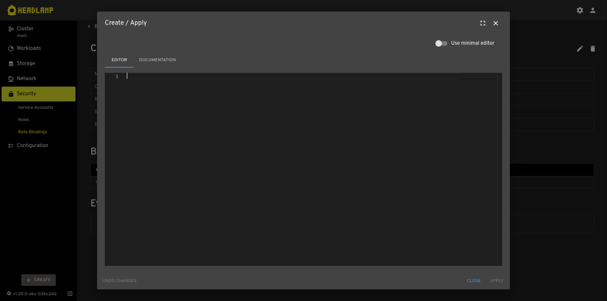
</p>


2. Configurar os campos "metadata/name" e "subjects/name" do seguinte código, com os dados do novo usuário, conforme exemplo:

```yaml
kind: ClusterRoleBinding
apiVersion: rbac.authorization.k8s.io/v1
metadata:
  name: headlamp-intuix-usuario
subjects:
  - kind: User
    apiGroup: rbac.authorization.k8s.io
    name: usuario@intuix.com.br
roleRef:
  apiGroup: rbac.authorization.k8s.io
  kind: ClusterRole
  name: cluster-admin
```

3. Clicar em "Apply".

##### Criando um usuário no Cognito:

1. Acessar o menu: "Amazon Cognito" > "User Pools" > "dev-apps".

<p align="center">
  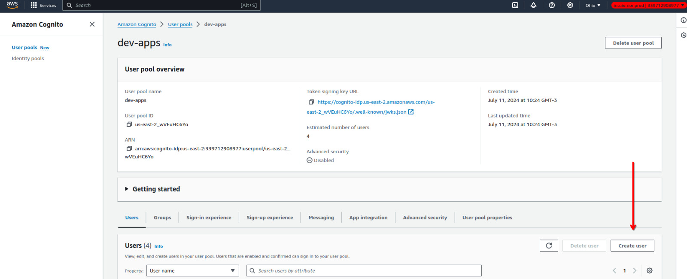
</p>

2. Clicar em "Create User"

<p align="center">
  
</p>

3. Marcar "Send an email invitation"

4. Preencher os campos necessários

5. Marcar "Generate Password"

6. Clicar em "Create User" para finalizar.

O usuário receberá em seu e-mail, seu login e senha para acesso ao Headlamp, através do link: https://headlamp.dev.intuix.com.br/c/main/login

Em seguida, será necessário escanear o código QR através de um aplicativo autenticador.

<p align="center">
  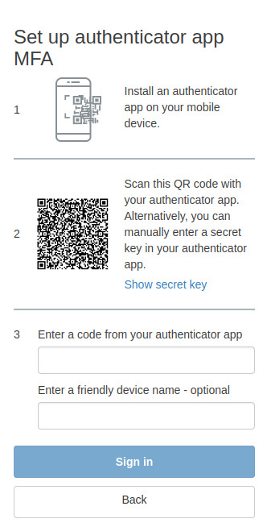
</p>

Após a configuração do aplicativo autenticador, o novo usuário terá acesso efetuado na interface do Headlamp.

### ArgoCD

https://argo-cd.readthedocs.io/en/stable/operator-manual/user-management/

Para que um novo usuário tenha acesso ao ArgoCD, basta incluir o usuário previamente criado no Cognito ao grupo: argocd-admin ou argocd-readonly.

<p align="center">
  
</p>
<p align="center">
  
</p>


### Grafana

https://grafana.com/docs/grafana/latest/setup-grafana/configure-security/configure-authentication/

Assim como no ArgoCD, para que o novo usuário tenha acesso ao Grafana, basta incluir o usuário previamente criado no Cognito ao grupo: grafana-admin, ou grafana-readonly.

<p align="center">
  
</p>
<p align="center">
  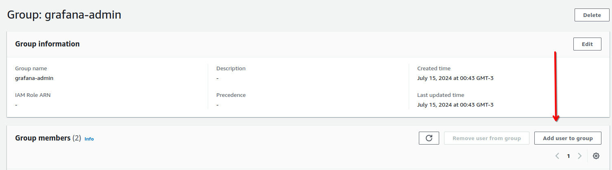
</p>





# SSO Ferramentas ECS

Alguns ferramentas implementadas permitem que a autenticação seja delegada a um terceiro, que pode ser GSuite ou Azure Active Directory por exemplo. Abaixo segue os link da documentação de cada ferramenta:

### Grafana

https://grafana.com/docs/grafana/latest/setup-grafana/configure-security/configure-authentication/






# SSO GSuite AWS  _

## Configuração

Pré-requisitos:

-   Acesso administrativo ao GSuite
    

3.  Logar com uma conta com perfil de administrador no GSuite: [https://admin.google.com](https://admin.google.com/)
    
4.  Acessar no menu lateral esquerdo **Diretório** e em seguida clicar em **Usuários**.
    
5.  Na tela seguinte clique em **Mais opções** e em seguida **Gerenciar atributos personalizados**.
    

<p align="center">
  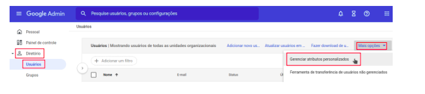
</p>

6.  Clicar em **Adicionar Atributo Personalizado**.
    

<p align="center">
  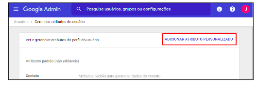
</p>

7.  Definir a categoria **AWS SAML,** adicionar os seguintes atributos e salvar conforme imagem:
    
	1.  Nome: IAM Role
        
	2.  Tipo: Texto
        
	3.  Número de valores: Valores múltiplos

	4.  Nome: SessionDuration
    
	5.  Tipo: Número inteiro
    
	6.  Número de valores: Valor único  
      
      
    

<p align="center">
  
</p>

  

8.  Acessar no menu lateral esquerdo **Apps** e em seguida clicar em **Apps da Web e para dispositivos móveis**.
    

<p align="center">
  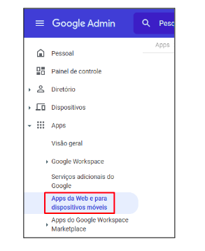
</p>

9.  Na tela seguinte clique em **Adicionar App** e em seguida em "Pesquisar  **apps".**
    

<p align="center">
  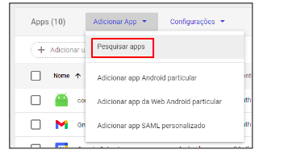
</p>

10.  Pesquisar por “Amazon Web Services” e selecionar conforme a tela abaixo.
    

<p align="center">
  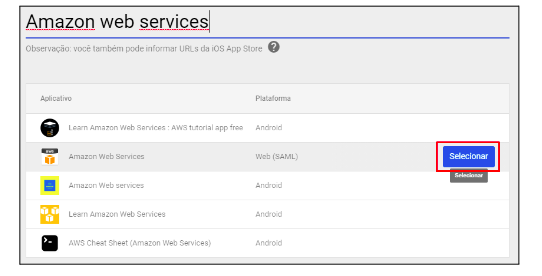
</p>

11.  Na tela seguinte clicar em **FAZER DOWNLOAD DOS METADADOS**. **Será necessário enviar esse arquivo para a DNX Brasil**. Em seguida, clique em **CONTINUAR**.
    

<p align="center">
  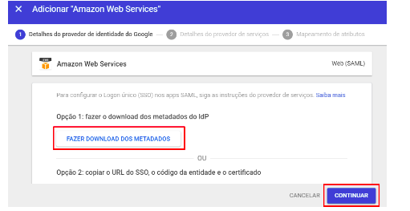
</p>

12.  Na tela seguinte não precisa modificar os campos. Apenas clicar em **CONTINUAR**.
    

<p align="center">
  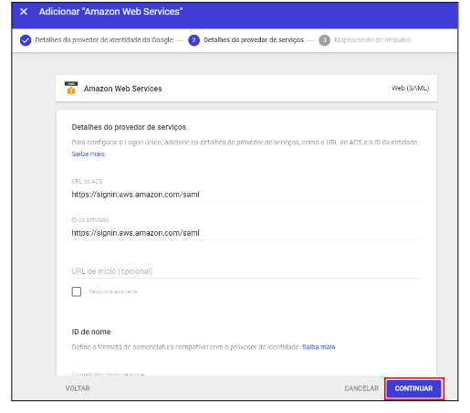
</p>

13.  Na tela seguinte realizar o mapeamento dos atributos de acordo com os campos personalizados criados anteriormente. Mapear conforme a imagem abaixo e finalizar em CONCLUIR.
    

<p align="center">
  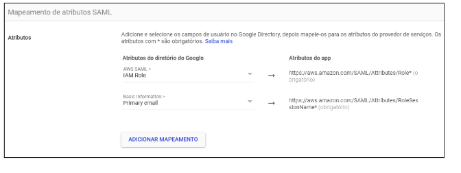
</p>
  
  

14.  Após finalizada a adição do aplicativo é necessário ativá-lo para permitir o acesso dos usuários. Ativar conforme a figura abaixo.
    

<p align="center">
  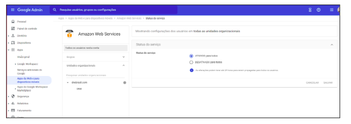
</p>
  
  

#   
  

# Roles GSuite_

## Configuração

Pré-requisitos:

-   Acesso administrativo ao GSuite
    

  
  

Para dar permissões aos usuários GSuite nas contas AWS, basta adicionar as respectivas roles listadas abaixo nos atributos dos usuários GSuite seguindo os passos a seguir:

  
  

1.  Logar com uma conta com perfil de administrador no Gsuite: [https://admin.google.com](https://admin.google.com/)
    
2.  Acessar no menu lateral esquerdo **Diretório** e em seguida clicar em **Usuários**.
    
3.  Clicar no usuário que deseja adicionar a role.
    
4.  Na tela do usuário clique em **Informações do usuário** para expandir.
    
5.  Editar a seção **AWS SAML** e informar a role desejada no campo **IAM Role**. Um usuário pode ter múltiplas roles, basta adicionar as roles em linhas separadas.
    
6.  No campo **SessionDuration** informe a duração da sessão em segundos, valor padrão **43200**.
    

O preenchimento dos campos deverá ficar assim, respeitando os valores para IAM Role informados nas próximas páginas:

  

<p align="center">
  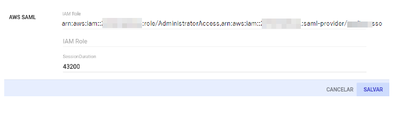
</p>

  

##   
  

## Conta Shared-Services

IAM Roles com acesso a conta **{{ ACCOUNT_NAME_SERVICES }}** (serviços – ID: **{{ ACCOUNT_ID_SERVICES }}**)

  
  

AdministratorAccess

    arn:aws:iam::{{ ACCOUNT_ID_SERVICES }}:role/AdministratorAccess,arn:aws:iam::{{ ACCOUNT_ID_SERVICES }}:saml-provider/{{ CLIENT_NAME }}-sso

  

ViewOnlyAccess

    arn:aws:iam::{{ ACCOUNT_ID_SERVICES }}:role/ViewOnlyAccess,arn:aws:iam::{{ ACCOUNT_ID_SERVICES }}:saml-provider/{{ CLIENT_NAME }}-sso

## Conta Nonprod

IAM Roles com acesso a conta **{{ ACCOUNT_NAME_NONPROD }}** (não produtiva – ID: **{{ ACCOUNT_ID_NONPROD }}**)

  

AdministratorAccess

    arn:aws:iam::{{ ACCOUNT_ID_NONPROD }}:role/AdministratorAccess,arn:aws:iam::{{ ACCOUNT_ID_NONPROD }}:saml-provider/{{ CLIENT_NAME }}-sso

  

DatabaseAdministrator

    arn:aws:iam::{{ ACCOUNT_ID_NONPROD }}:role/DatabaseAdministrator,arn:aws:iam::{{ ACCOUNT_ID_NONPROD }}:saml-provider/{{ CLIENT_NAME }}-sso

  

DataScientist

    arn:aws:iam::{{ ACCOUNT_ID_NONPROD }}:role/DataScientist,arn:aws:iam::{{ ACCOUNT_ID_NONPROD }}:saml-provider/{{ CLIENT_NAME }}-sso

  

NetworkAdministrator

    arn:aws:iam::{{ ACCOUNT_ID_NONPROD }}:role/NetworkAdministrator,arn:aws:iam::{{ ACCOUNT_ID_NONPROD }}:saml-provider/{{ CLIENT_NAME }}-sso

  

PowerUserAccess

    arn:aws:iam::{{ ACCOUNT_ID_NONPROD }}:role/PowerUserAccess,arn:aws:iam::{{ ACCOUNT_ID_NONPROD }}:saml-provider/{{ CLIENT_NAME }}-sso

  

SecurityAudit

    arn:aws:iam::{{ ACCOUNT_ID_NONPROD }}:role/SecurityAudit,arn:aws:iam::{{ ACCOUNT_ID_NONPROD }}:saml-provider/{{ CLIENT_NAME }}-sso

  

SupportUser

    arn:aws:iam::{{ ACCOUNT_ID_NONPROD }}:role/SupportUser,arn:aws:iam::{{ ACCOUNT_ID_NONPROD }}:saml-provider/{{ CLIENT_NAME }}-sso

  

SystemAdministrator

    arn:aws:iam::{{ ACCOUNT_ID_NONPROD }}:role/SystemAdministrator,arn:aws:iam::{{ ACCOUNT_ID_NONPROD }}:saml-provider/{{ CLIENT_NAME }}-sso

  

ViewOnlyAccess

    arn:aws:iam::{{ ACCOUNT_ID_NONPROD }}:role/ViewOnlyAccess,arn:aws:iam::{{ ACCOUNT_ID_NONPROD }}:saml-provider/{{ CLIENT_NAME }}-sso

## Conta Prod

IAM Roles com acesso a conta **{{ ACCOUNT_NAME_PROD }}** (produtiva – ID: **{{ ACCOUNT_ID_PROD }}**)

  
  

AdministratorAccess

    arn:aws:iam::{{ ACCOUNT_ID_PROD }}:role/AdministratorAccess,arn:aws:iam::{{ ACCOUNT_ID_PROD }}:saml-provider/{{ CLIENT_NAME }}-sso

  

DatabaseAdministrator

    arn:aws:iam::{{ ACCOUNT_ID_PROD }}:role/DatabaseAdministrator,arn:aws:iam::{{ ACCOUNT_ID_PROD }}:saml-provider/{{ CLIENT_NAME }}-sso

  

DataScientist

    arn:aws:iam::{{ ACCOUNT_ID_PROD }}:role/DataScientist,arn:aws:iam::{{ ACCOUNT_ID_PROD }}:saml-provider/{{ CLIENT_NAME }}-sso

  

NetworkAdministrator

    arn:aws:iam::{{ ACCOUNT_ID_PROD }}:role/NetworkAdministrator,arn:aws:iam::{{ ACCOUNT_ID_PROD }}:saml-provider/{{ CLIENT_NAME }}-sso

  

PowerUserAccess

    arn:aws:iam::{{ ACCOUNT_ID_PROD }}:role/PowerUserAccess,arn:aws:iam::{{ ACCOUNT_ID_PROD }}:saml-provider/{{ CLIENT_NAME }}-sso

  

SecurityAudit

    arn:aws:iam::{{ ACCOUNT_ID_PROD }}:role/SecurityAudit,arn:aws:iam::{{ ACCOUNT_ID_PROD }}:saml-provider/{{ CLIENT_NAME }}-sso

  

SupportUser

    arn:aws:iam::{{ ACCOUNT_ID_PROD }}:role/SupportUser,arn:aws:iam::{{ ACCOUNT_ID_PROD }}:saml-provider/{{ CLIENT_NAME }}-sso

  

SystemAdministrator

    arn:aws:iam::{{ ACCOUNT_ID_PROD }}:role/SystemAdministrator,arn:aws:iam::{{ ACCOUNT_ID_PROD }}:saml-provider/{{ CLIENT_NAME }}-sso

  

ViewOnlyAccess

    arn:aws:iam::{{ ACCOUNT_ID_PROD }}:role/ViewOnlyAccess,arn:aws:iam::{{ ACCOUNT_ID_PROD }}:saml-provider/{{ CLIENT_NAME }}-sso

  

  

## Testando o Acesso SSO

1.  Logar com sua conta de e-mail no Gsuite.
    
2.  Clicar no botão de listar app.
    
3.  Rolar até encontrar o ícone do Amazon Web Services e clicar nele.
    

<p align="center">
  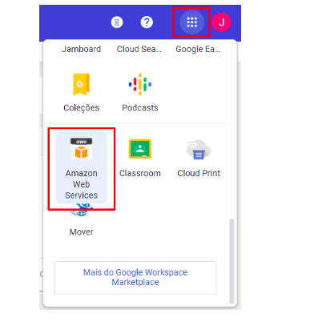
</p>

  
  

4.  Escolher a role que deseja logar e clicar em Sign In.
    

<p align="center">
  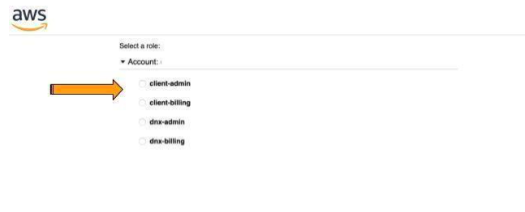
</p>







# Criação de Usuário Pritunl VPN

### Obtendo a senha padrão do Administrador
Após a criação da EC2 com a VPN do Pritunl, é necessário se conectar à máquina e executar os seguintes comandos para obter a senha padrão do Administrador da VPN ou acessar o SSM Parameter para recupera-la:

```
sudo su - 
pritunl default-password
```

Em seguida, acesse a URL da VPN (normalmente pritunl.ambiente.seudominio.com.br) e faça login com as credenciais obtidas anteriormente. 
Um pop-up solicitando o setup inicial irá aparecer. Insira o usuário padrão do pritunl e certifique-se de mudar o endereço público da VPN para a URL usada para acessá-la. Após deixar a configuração conforme mostrado na figura, clique em _Save_.

<p align="center">
  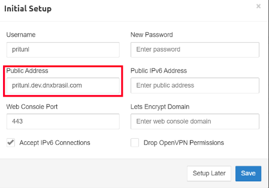
</p>


### Criando uma organização e um servidor Pritunl

Para utilizar a VPN, é necessário criar uma organização e um servidor. 
**Para criar uma organização**, clique em Users no menu superior e em seguida clique em _Add Organization_.

<p align="center">
  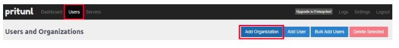
</p>


Entre com o nome da organização desejado e clique em Add.

<p align="center">
  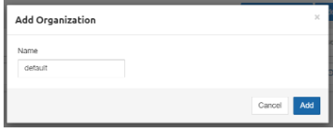
</p>


Criada a organização, vamos **criar o servidor da VPN**. No menu superior, clique em Servers e em seguida _Add Server_.

<p align="center">
  
</p>


  Insira o nome do servidor, troque a porta para 1194 com o protocolo TCP, ative o Google Authenticator e clique em _Add_, conforme mostra a imagem abaixo. Os demais campos ficarão com o valor padrão.

<p align="center">
  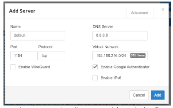
</p>


Feito isso, devemos attachar a organização no servidor criado. Para tal, clique em _Attach Organization_, ainda na página dos Servidores.

<p align="center">
  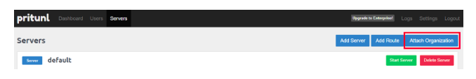
</p>


Selecione a organização e o servidor criados e clique em _Attach_.

<p align="center">
  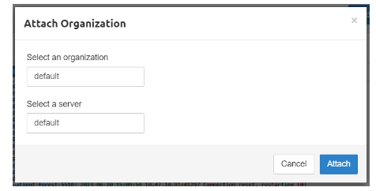
</p>


Em seguida, start o servidor clicando em _Start Server_.

<p align="center">
  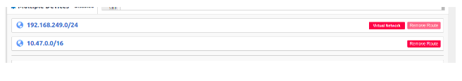
</p>


### Gerenciando de usuários VPN Pritunl
Para criar um usuário, clique em _Add User_ na mesma página _(Users)_ onde foi criada a organização.

<p align="center">
  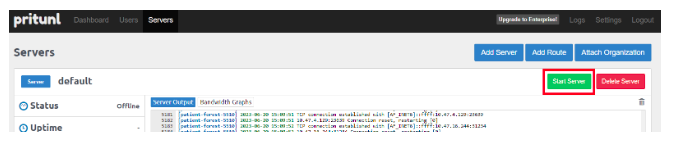
</p>


Insira o nome de usuário e selecione a organização à qual o usuário pertence. O e-mail pode ser deixado em branco. No campo do Pin, insira um valor de no mínimo 6 dígitos. Esse valor será solicitado toda vez que o usuário se conectar na VPN, e portanto deve ser informado ao dono do usuário criado.

<p align="center">
  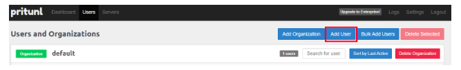
</p>


Após a criação, devem ser enviados, além do Pin, o QR Code (MFA) e o arquivo .ovpn necessários para a conexão com a VPN para o respectivo usuário. Para tal, clique no segundo ícone do lado direito do nome do usuário. 

<p align="center">
  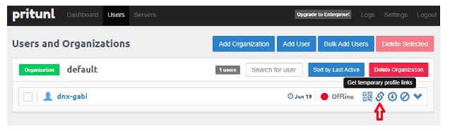
</p>


 Um pop-up irá abrir com 4 opções de link. Selecione o terceira e envie para o usuário.

<p align="center">
  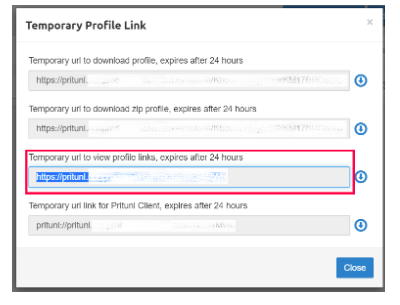
</p>


  Ao abrir a página, o usuário deverá scannear o QR Code com o aplicativo autenticador de preferência para habilitar o MFA, e depois clicar em _Show More_ no canto inferior.

<p align="center">
  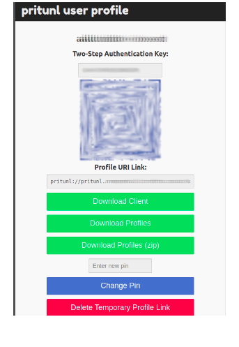
</p>


Copie a URI disponibilizada em Profile URI Link para ser adicionada ao aplicativo após a instalação. O próximo passo é clicar em Download Client e selecionar seu respectivo sistema operacional para baixar o cliente do Pritunl, ou acesse o link abaixo para fazer o download.

Pritunl Client - Open Source OpenVPN Client
https://client.pritunl.com/#install

Caso deseje remover um usuário, acesse a página de Users, selecione o usuário e clique em Delete Selected.

<p align="center">
  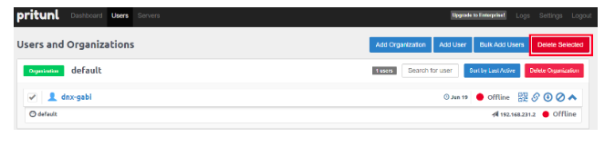
</p>


## Utilização

Com a URI em mãos.  

<p align="center">
  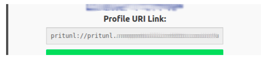
</p>


Inicie o aplicativo Pritunl Client e selecione a opção Import.

<p align="center">
  
</p>


Em seguida, cole no campo Profile URI o link copiado no step acima e selecione a opção “Import”.

<p align="center">
  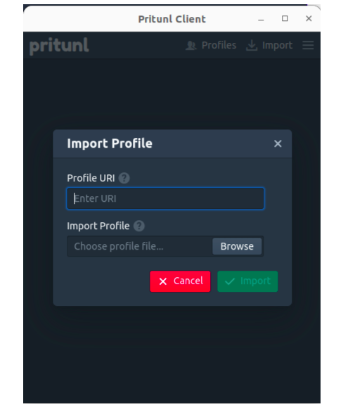
</p>


Após importar, seu usuário será adicionado ao aplicativo e você terá acesso a VPN selecionando a opção “Conectar”. Será solicitado o código MFA que está em seu aplicativo autenticador. 

<p align="center">
  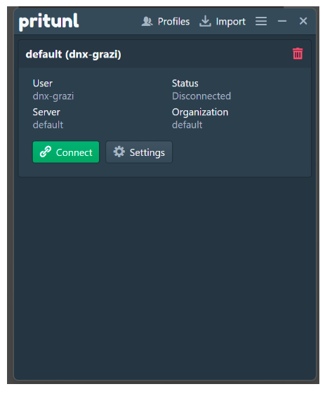
</p>


# Ativação do MFA nas Contas da AWS
### Configuração
1. Primeiramente, precisamos obter acesso root à cada conta. Para isso, deve-se acessar a página de Login no Console da AWS. https://aws.amazon.com/console/
2. Escolher entrar com “Root user” ou “Usuário root” e digitar o e-mail associado à cada conta criada
3. Clicar em “Next” ou “Próximo”.
<p align="center">
  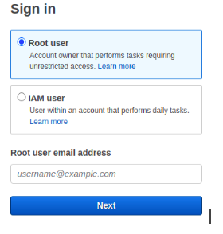
</p>
4. Digitar o captcha e clicar em “Submit” ou “Enviar”.
<p align="center">
  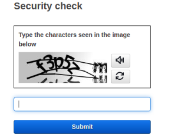
</p>
5. Clicar em “Forgot password?” ou “Esqueceu a senha?”.
<p align="center">
  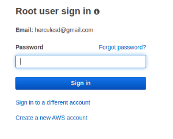
</p>
6. Verificar a caixa de entrada do e-mail utilizado. Clicar no link para redefinição da senha.
7. Digitar nova senha e confirmar. Clicar em “Reset password” ou “Redefinir senha”.

<p align="center">
  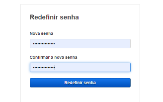
</p>

8. Voltar à página de Login e entrar na conta utilizando sua nova senha.
<p align="center">
  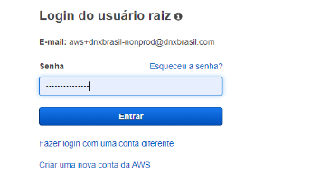
</p>
9. Após autenticar na conta, clicar no nome da mesma, no canto superior direito, e em seguida, clicar em “My Security Credentials” ou “Minhas Credenciais de Segurança”.
<p align="center">
  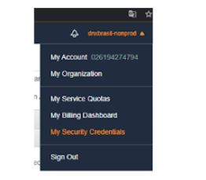
</p>

10. Clicar em “Multi-factor authentication (MFA)” ou “Autenticação multifator (MFA)”. Em seguida clicar em “Activate MFA” ou “Ativar MFA”.
<p align="center">
  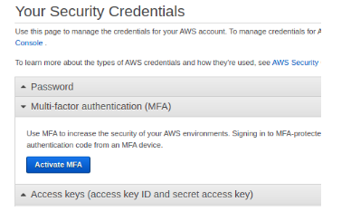
</p>
11. Selecionar “Virtual MFA device” ou “Dispositivo MFA virtual”. E clicar em “Continue”.
<p align="center">
  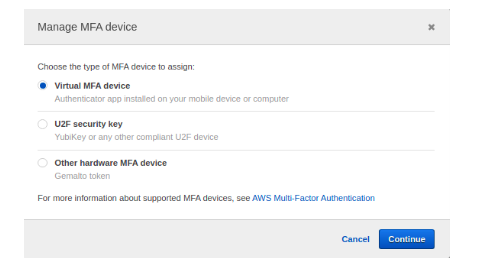
</p>


12. Instale em seu dispositivo móvel um aplicativo compatível para autentição em duas etapas. Por exemplo: Google Authenticator ou Authy (*Recomendado, pois tem a opção de recuperação se trocar o aparelho).


13. Clicar em “Show QR Code” e utilizar o aplicativo para ler o código QR.

<p align="center">
  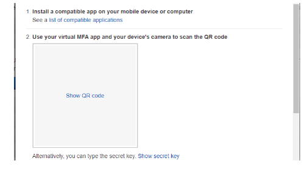
</p>


14. O aplicativo reconhecerá o QR Code e mostrará um código temporário para autenticação. Digite dois códigos consecutivos nos campos MFA code 1 e MFA code 2.

<p align="center">
  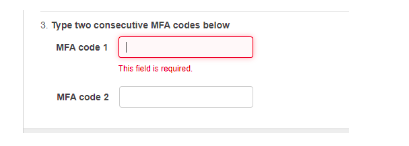
</p>


15. Por fim, clicar em “Assign MFA” ou “Atribuir MFA”.

<p align="center">
  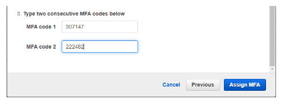
</p>

16. Pronto! A partir de agora, será necessário acesso ao aplicativo mobile para realizar Login na conta usando MFA.


