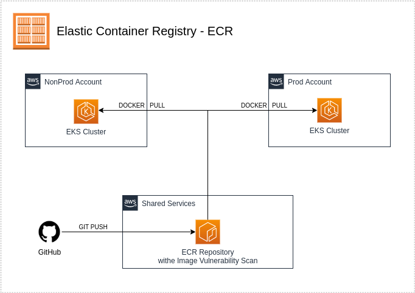

# utilities

### The module

This module setup an ECR Repositorires, Code Build/Pipeline, Backup Service, Log Exporter and ACM Certificate Request.

This module creates the following resources:
 - AWS Backup Vault:
    + **vault-(account)-backup**
 - AWS Backup Plan:
    + **(account)-backup**
 - AWS Backup Selection:
    + **selection-(account)-backup**
 - IAM Role:
    + **backupRole**
    + **log-exporter-**
    + **codeBuildRole**
    + **codepipelineRole**
 - IAM Policy:
    + **infra-deploy-shared**
 - Lambda:
    + **log-exporter-**
 - ECR repositories
 - ECR Repository Policy
 - Code Pipeline and Code Build
 - Audit logs export
 - Request Certificates in ACM
 - CloudWatch Log Group
 - S3:
    + **codepipelineBucket**
 - KMS:
    + **codepipelineRole**

### Applied to stacks
 - nonprod
 - prod
 - shared

## Inputs

| Name | Description | Type | Default | Required |
|------|-------------|------|---------|:--------:|
| pulumiOrg | Organization created at Pulumi Cloud | `string` | n/a | yes |
| region | Region where resources will be created | `string` | "" | yes |
| account | AWS Account name | `string` | n/a | yes |
| accountNumber | AWS Account number | `string` | n/a | yes |
| backupSchedule | Backup scheduler cron | `string` | n/a | yes |
| backupStartWindow | Backup start windows | `number` | `60` | yes |
| backupCompletionWindow | Time for complete backup | `number` | `120` | yes |
| backupColdStorageAfter | Days for move backup to s3 glacier | `number` | `30` | yes |
| backupDeleteAfter | Number of days to delete the backup | `number` | `120` | yes |
| selectionTagType | Condition for realize backup | `string` | `STRINGEQUALS` | yes |
| selectionTagKey | Tag key select for backup | `string` | `Backup` | yes |
| selectionTagValue | Backup tag value expect | `string` | `true` | yes |
| ecrREpos | List of ecr repo names | `list(string)` | [] | no |
| useDefaultDomain | Resources will use the domain created in Network stack | `bool` | n/a | yes |
| domainName | Domain hosted zone account | `string` | n/a | yes |
| skipNetwork | If step depends on Network Stack | `bool` | n/a | yes |
| certificates | If create acm request ceritificate | `list(object)` | [] | no |
| ecrTrustAccounts | List of account wiht permission for pull images from ECR | `list(string)` | n/a | no |
| pulumiToken | Pulumi token for pipeline in CodeServices | `string` | n/a | no |
| repositories | List of repositories pulumi stack | `list(object)` | n/a | no |

## Outputs

| Name | Description |
|------|-------------|
| acm | List of certificates arn| 

## Author

Module managed by [DNXBrasil](https://dnxbrasil.com).